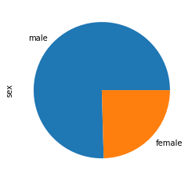
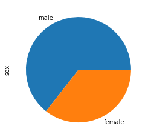
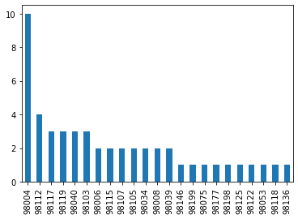
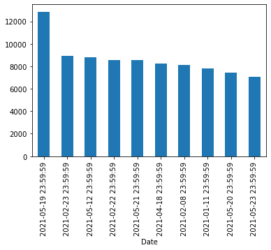

# Adding & Removing Columns


```python
import pandas as pd
houses = pd.read_csv("data/kc_house_data.csv")
titanic = pd.read_csv("data/titanic.csv")
netflix = pd.read_csv("data/netflix_titles.csv", sep="|", index_col=0)
btc = pd.read_csv("data/coin_Bitcoin.csv")
countries = pd.read_csv("data/world-happiness-report-2021.csv")
```


```python
countries.set_index("Country name", inplace=True)
```

## Dropping Rows/Cols


```python
btc.drop(labels="Symbol", axis=1)
```


<div>
<style scoped>
    .dataframe tbody tr th:only-of-type {
        vertical-align: middle;
    }

    .dataframe tbody tr th {
        vertical-align: top;
    }

    .dataframe thead th {
        text-align: right;
    }
</style>
<table border="1" class="dataframe">
  <thead>
    <tr style="text-align: right;">
      <th></th>
      <th>SNo</th>
      <th>Name</th>
      <th>Date</th>
      <th>High</th>
      <th>Low</th>
      <th>Open</th>
      <th>Close</th>
      <th>Volume</th>
      <th>Marketcap</th>
    </tr>
  </thead>
  <tbody>
    <tr>
      <th>0</th>
      <td>1</td>
      <td>Bitcoin</td>
      <td>2013-04-29 23:59:59</td>
      <td>147.488007</td>
      <td>134.000000</td>
      <td>134.444000</td>
      <td>144.539993</td>
      <td>0.000000e+00</td>
      <td>1.603769e+09</td>
    </tr>
    <tr>
      <th>1</th>
      <td>2</td>
      <td>Bitcoin</td>
      <td>2013-04-30 23:59:59</td>
      <td>146.929993</td>
      <td>134.050003</td>
      <td>144.000000</td>
      <td>139.000000</td>
      <td>0.000000e+00</td>
      <td>1.542813e+09</td>
    </tr>
    <tr>
      <th>2</th>
      <td>3</td>
      <td>Bitcoin</td>
      <td>2013-05-01 23:59:59</td>
      <td>139.889999</td>
      <td>107.720001</td>
      <td>139.000000</td>
      <td>116.989998</td>
      <td>0.000000e+00</td>
      <td>1.298955e+09</td>
    </tr>
    <tr>
      <th>3</th>
      <td>4</td>
      <td>Bitcoin</td>
      <td>2013-05-02 23:59:59</td>
      <td>125.599998</td>
      <td>92.281898</td>
      <td>116.379997</td>
      <td>105.209999</td>
      <td>0.000000e+00</td>
      <td>1.168517e+09</td>
    </tr>
    <tr>
      <th>4</th>
      <td>5</td>
      <td>Bitcoin</td>
      <td>2013-05-03 23:59:59</td>
      <td>108.127998</td>
      <td>79.099998</td>
      <td>106.250000</td>
      <td>97.750000</td>
      <td>0.000000e+00</td>
      <td>1.085995e+09</td>
    </tr>
    <tr>
      <th>...</th>
      <td>...</td>
      <td>...</td>
      <td>...</td>
      <td>...</td>
      <td>...</td>
      <td>...</td>
      <td>...</td>
      <td>...</td>
      <td>...</td>
    </tr>
    <tr>
      <th>2986</th>
      <td>2987</td>
      <td>Bitcoin</td>
      <td>2021-07-02 23:59:59</td>
      <td>33939.588699</td>
      <td>32770.680780</td>
      <td>33549.600177</td>
      <td>33897.048590</td>
      <td>3.872897e+10</td>
      <td>6.354508e+11</td>
    </tr>
    <tr>
      <th>2987</th>
      <td>2988</td>
      <td>Bitcoin</td>
      <td>2021-07-03 23:59:59</td>
      <td>34909.259899</td>
      <td>33402.696536</td>
      <td>33854.421362</td>
      <td>34668.548402</td>
      <td>2.438396e+10</td>
      <td>6.499397e+11</td>
    </tr>
    <tr>
      <th>2988</th>
      <td>2989</td>
      <td>Bitcoin</td>
      <td>2021-07-04 23:59:59</td>
      <td>35937.567147</td>
      <td>34396.477458</td>
      <td>34665.564866</td>
      <td>35287.779766</td>
      <td>2.492431e+10</td>
      <td>6.615748e+11</td>
    </tr>
    <tr>
      <th>2989</th>
      <td>2990</td>
      <td>Bitcoin</td>
      <td>2021-07-05 23:59:59</td>
      <td>35284.344430</td>
      <td>33213.661034</td>
      <td>35284.344430</td>
      <td>33746.002456</td>
      <td>2.672155e+10</td>
      <td>6.326962e+11</td>
    </tr>
    <tr>
      <th>2990</th>
      <td>2991</td>
      <td>Bitcoin</td>
      <td>2021-07-06 23:59:59</td>
      <td>35038.536363</td>
      <td>33599.916169</td>
      <td>33723.509655</td>
      <td>34235.193451</td>
      <td>2.650126e+10</td>
      <td>6.418992e+11</td>
    </tr>
  </tbody>
</table>
<p>2991 rows × 9 columns</p>
</div>


```python
btc
```


<div>
<style scoped>
    .dataframe tbody tr th:only-of-type {
        vertical-align: middle;
    }

    .dataframe tbody tr th {
        vertical-align: top;
    }

    .dataframe thead th {
        text-align: right;
    }
</style>
<table border="1" class="dataframe">
  <thead>
    <tr style="text-align: right;">
      <th></th>
      <th>SNo</th>
      <th>Name</th>
      <th>Symbol</th>
      <th>Date</th>
      <th>High</th>
      <th>Low</th>
      <th>Open</th>
      <th>Close</th>
      <th>Volume</th>
      <th>Marketcap</th>
    </tr>
  </thead>
  <tbody>
    <tr>
      <th>0</th>
      <td>1</td>
      <td>Bitcoin</td>
      <td>BTC</td>
      <td>2013-04-29 23:59:59</td>
      <td>147.488007</td>
      <td>134.000000</td>
      <td>134.444000</td>
      <td>144.539993</td>
      <td>0.000000e+00</td>
      <td>1.603769e+09</td>
    </tr>
    <tr>
      <th>1</th>
      <td>2</td>
      <td>Bitcoin</td>
      <td>BTC</td>
      <td>2013-04-30 23:59:59</td>
      <td>146.929993</td>
      <td>134.050003</td>
      <td>144.000000</td>
      <td>139.000000</td>
      <td>0.000000e+00</td>
      <td>1.542813e+09</td>
    </tr>
    <tr>
      <th>2</th>
      <td>3</td>
      <td>Bitcoin</td>
      <td>BTC</td>
      <td>2013-05-01 23:59:59</td>
      <td>139.889999</td>
      <td>107.720001</td>
      <td>139.000000</td>
      <td>116.989998</td>
      <td>0.000000e+00</td>
      <td>1.298955e+09</td>
    </tr>
    <tr>
      <th>3</th>
      <td>4</td>
      <td>Bitcoin</td>
      <td>BTC</td>
      <td>2013-05-02 23:59:59</td>
      <td>125.599998</td>
      <td>92.281898</td>
      <td>116.379997</td>
      <td>105.209999</td>
      <td>0.000000e+00</td>
      <td>1.168517e+09</td>
    </tr>
    <tr>
      <th>4</th>
      <td>5</td>
      <td>Bitcoin</td>
      <td>BTC</td>
      <td>2013-05-03 23:59:59</td>
      <td>108.127998</td>
      <td>79.099998</td>
      <td>106.250000</td>
      <td>97.750000</td>
      <td>0.000000e+00</td>
      <td>1.085995e+09</td>
    </tr>
    <tr>
      <th>...</th>
      <td>...</td>
      <td>...</td>
      <td>...</td>
      <td>...</td>
      <td>...</td>
      <td>...</td>
      <td>...</td>
      <td>...</td>
      <td>...</td>
      <td>...</td>
    </tr>
    <tr>
      <th>2986</th>
      <td>2987</td>
      <td>Bitcoin</td>
      <td>BTC</td>
      <td>2021-07-02 23:59:59</td>
      <td>33939.588699</td>
      <td>32770.680780</td>
      <td>33549.600177</td>
      <td>33897.048590</td>
      <td>3.872897e+10</td>
      <td>6.354508e+11</td>
    </tr>
    <tr>
      <th>2987</th>
      <td>2988</td>
      <td>Bitcoin</td>
      <td>BTC</td>
      <td>2021-07-03 23:59:59</td>
      <td>34909.259899</td>
      <td>33402.696536</td>
      <td>33854.421362</td>
      <td>34668.548402</td>
      <td>2.438396e+10</td>
      <td>6.499397e+11</td>
    </tr>
    <tr>
      <th>2988</th>
      <td>2989</td>
      <td>Bitcoin</td>
      <td>BTC</td>
      <td>2021-07-04 23:59:59</td>
      <td>35937.567147</td>
      <td>34396.477458</td>
      <td>34665.564866</td>
      <td>35287.779766</td>
      <td>2.492431e+10</td>
      <td>6.615748e+11</td>
    </tr>
    <tr>
      <th>2989</th>
      <td>2990</td>
      <td>Bitcoin</td>
      <td>BTC</td>
      <td>2021-07-05 23:59:59</td>
      <td>35284.344430</td>
      <td>33213.661034</td>
      <td>35284.344430</td>
      <td>33746.002456</td>
      <td>2.672155e+10</td>
      <td>6.326962e+11</td>
    </tr>
    <tr>
      <th>2990</th>
      <td>2991</td>
      <td>Bitcoin</td>
      <td>BTC</td>
      <td>2021-07-06 23:59:59</td>
      <td>35038.536363</td>
      <td>33599.916169</td>
      <td>33723.509655</td>
      <td>34235.193451</td>
      <td>2.650126e+10</td>
      <td>6.418992e+11</td>
    </tr>
  </tbody>
</table>
<p>2991 rows × 10 columns</p>
</div>


```python
btc.drop(labels=["SNo", "Name", "Symbol"], axis='columns')
```


<div>
<style scoped>
    .dataframe tbody tr th:only-of-type {
        vertical-align: middle;
    }

    .dataframe tbody tr th {
        vertical-align: top;
    }

    .dataframe thead th {
        text-align: right;
    }
</style>
<table border="1" class="dataframe">
  <thead>
    <tr style="text-align: right;">
      <th></th>
      <th>Date</th>
      <th>High</th>
      <th>Low</th>
      <th>Open</th>
      <th>Close</th>
      <th>Volume</th>
      <th>Marketcap</th>
    </tr>
  </thead>
  <tbody>
    <tr>
      <th>0</th>
      <td>2013-04-29 23:59:59</td>
      <td>147.488007</td>
      <td>134.000000</td>
      <td>134.444000</td>
      <td>144.539993</td>
      <td>0.000000e+00</td>
      <td>1.603769e+09</td>
    </tr>
    <tr>
      <th>1</th>
      <td>2013-04-30 23:59:59</td>
      <td>146.929993</td>
      <td>134.050003</td>
      <td>144.000000</td>
      <td>139.000000</td>
      <td>0.000000e+00</td>
      <td>1.542813e+09</td>
    </tr>
    <tr>
      <th>2</th>
      <td>2013-05-01 23:59:59</td>
      <td>139.889999</td>
      <td>107.720001</td>
      <td>139.000000</td>
      <td>116.989998</td>
      <td>0.000000e+00</td>
      <td>1.298955e+09</td>
    </tr>
    <tr>
      <th>3</th>
      <td>2013-05-02 23:59:59</td>
      <td>125.599998</td>
      <td>92.281898</td>
      <td>116.379997</td>
      <td>105.209999</td>
      <td>0.000000e+00</td>
      <td>1.168517e+09</td>
    </tr>
    <tr>
      <th>4</th>
      <td>2013-05-03 23:59:59</td>
      <td>108.127998</td>
      <td>79.099998</td>
      <td>106.250000</td>
      <td>97.750000</td>
      <td>0.000000e+00</td>
      <td>1.085995e+09</td>
    </tr>
    <tr>
      <th>...</th>
      <td>...</td>
      <td>...</td>
      <td>...</td>
      <td>...</td>
      <td>...</td>
      <td>...</td>
      <td>...</td>
    </tr>
    <tr>
      <th>2986</th>
      <td>2021-07-02 23:59:59</td>
      <td>33939.588699</td>
      <td>32770.680780</td>
      <td>33549.600177</td>
      <td>33897.048590</td>
      <td>3.872897e+10</td>
      <td>6.354508e+11</td>
    </tr>
    <tr>
      <th>2987</th>
      <td>2021-07-03 23:59:59</td>
      <td>34909.259899</td>
      <td>33402.696536</td>
      <td>33854.421362</td>
      <td>34668.548402</td>
      <td>2.438396e+10</td>
      <td>6.499397e+11</td>
    </tr>
    <tr>
      <th>2988</th>
      <td>2021-07-04 23:59:59</td>
      <td>35937.567147</td>
      <td>34396.477458</td>
      <td>34665.564866</td>
      <td>35287.779766</td>
      <td>2.492431e+10</td>
      <td>6.615748e+11</td>
    </tr>
    <tr>
      <th>2989</th>
      <td>2021-07-05 23:59:59</td>
      <td>35284.344430</td>
      <td>33213.661034</td>
      <td>35284.344430</td>
      <td>33746.002456</td>
      <td>2.672155e+10</td>
      <td>6.326962e+11</td>
    </tr>
    <tr>
      <th>2990</th>
      <td>2021-07-06 23:59:59</td>
      <td>35038.536363</td>
      <td>33599.916169</td>
      <td>33723.509655</td>
      <td>34235.193451</td>
      <td>2.650126e+10</td>
      <td>6.418992e+11</td>
    </tr>
  </tbody>
</table>
<p>2991 rows × 7 columns</p>
</div>


```python
# btc.drop(labels=["SNo", "Name", "Symbol"], axis='columns')
btc.drop(columns=["SNo", "Name", "Symbol"])
```


<div>
<style scoped>
    .dataframe tbody tr th:only-of-type {
        vertical-align: middle;
    }

    .dataframe tbody tr th {
        vertical-align: top;
    }

    .dataframe thead th {
        text-align: right;
    }
</style>
<table border="1" class="dataframe">
  <thead>
    <tr style="text-align: right;">
      <th></th>
      <th>Date</th>
      <th>High</th>
      <th>Low</th>
      <th>Open</th>
      <th>Close</th>
      <th>Volume</th>
      <th>Marketcap</th>
    </tr>
  </thead>
  <tbody>
    <tr>
      <th>0</th>
      <td>2013-04-29 23:59:59</td>
      <td>147.488007</td>
      <td>134.000000</td>
      <td>134.444000</td>
      <td>144.539993</td>
      <td>0.000000e+00</td>
      <td>1.603769e+09</td>
    </tr>
    <tr>
      <th>1</th>
      <td>2013-04-30 23:59:59</td>
      <td>146.929993</td>
      <td>134.050003</td>
      <td>144.000000</td>
      <td>139.000000</td>
      <td>0.000000e+00</td>
      <td>1.542813e+09</td>
    </tr>
    <tr>
      <th>2</th>
      <td>2013-05-01 23:59:59</td>
      <td>139.889999</td>
      <td>107.720001</td>
      <td>139.000000</td>
      <td>116.989998</td>
      <td>0.000000e+00</td>
      <td>1.298955e+09</td>
    </tr>
    <tr>
      <th>3</th>
      <td>2013-05-02 23:59:59</td>
      <td>125.599998</td>
      <td>92.281898</td>
      <td>116.379997</td>
      <td>105.209999</td>
      <td>0.000000e+00</td>
      <td>1.168517e+09</td>
    </tr>
    <tr>
      <th>4</th>
      <td>2013-05-03 23:59:59</td>
      <td>108.127998</td>
      <td>79.099998</td>
      <td>106.250000</td>
      <td>97.750000</td>
      <td>0.000000e+00</td>
      <td>1.085995e+09</td>
    </tr>
    <tr>
      <th>...</th>
      <td>...</td>
      <td>...</td>
      <td>...</td>
      <td>...</td>
      <td>...</td>
      <td>...</td>
      <td>...</td>
    </tr>
    <tr>
      <th>2986</th>
      <td>2021-07-02 23:59:59</td>
      <td>33939.588699</td>
      <td>32770.680780</td>
      <td>33549.600177</td>
      <td>33897.048590</td>
      <td>3.872897e+10</td>
      <td>6.354508e+11</td>
    </tr>
    <tr>
      <th>2987</th>
      <td>2021-07-03 23:59:59</td>
      <td>34909.259899</td>
      <td>33402.696536</td>
      <td>33854.421362</td>
      <td>34668.548402</td>
      <td>2.438396e+10</td>
      <td>6.499397e+11</td>
    </tr>
    <tr>
      <th>2988</th>
      <td>2021-07-04 23:59:59</td>
      <td>35937.567147</td>
      <td>34396.477458</td>
      <td>34665.564866</td>
      <td>35287.779766</td>
      <td>2.492431e+10</td>
      <td>6.615748e+11</td>
    </tr>
    <tr>
      <th>2989</th>
      <td>2021-07-05 23:59:59</td>
      <td>35284.344430</td>
      <td>33213.661034</td>
      <td>35284.344430</td>
      <td>33746.002456</td>
      <td>2.672155e+10</td>
      <td>6.326962e+11</td>
    </tr>
    <tr>
      <th>2990</th>
      <td>2021-07-06 23:59:59</td>
      <td>35038.536363</td>
      <td>33599.916169</td>
      <td>33723.509655</td>
      <td>34235.193451</td>
      <td>2.650126e+10</td>
      <td>6.418992e+11</td>
    </tr>
  </tbody>
</table>
<p>2991 rows × 7 columns</p>
</div>


```python
btc[["Date", "High", "Low"]]
```


<div>
<style scoped>
    .dataframe tbody tr th:only-of-type {
        vertical-align: middle;
    }

    .dataframe tbody tr th {
        vertical-align: top;
    }

    .dataframe thead th {
        text-align: right;
    }
</style>
<table border="1" class="dataframe">
  <thead>
    <tr style="text-align: right;">
      <th></th>
      <th>Date</th>
      <th>High</th>
      <th>Low</th>
    </tr>
  </thead>
  <tbody>
    <tr>
      <th>0</th>
      <td>2013-04-29 23:59:59</td>
      <td>147.488007</td>
      <td>134.000000</td>
    </tr>
    <tr>
      <th>1</th>
      <td>2013-04-30 23:59:59</td>
      <td>146.929993</td>
      <td>134.050003</td>
    </tr>
    <tr>
      <th>2</th>
      <td>2013-05-01 23:59:59</td>
      <td>139.889999</td>
      <td>107.720001</td>
    </tr>
    <tr>
      <th>3</th>
      <td>2013-05-02 23:59:59</td>
      <td>125.599998</td>
      <td>92.281898</td>
    </tr>
    <tr>
      <th>4</th>
      <td>2013-05-03 23:59:59</td>
      <td>108.127998</td>
      <td>79.099998</td>
    </tr>
    <tr>
      <th>...</th>
      <td>...</td>
      <td>...</td>
      <td>...</td>
    </tr>
    <tr>
      <th>2986</th>
      <td>2021-07-02 23:59:59</td>
      <td>33939.588699</td>
      <td>32770.680780</td>
    </tr>
    <tr>
      <th>2987</th>
      <td>2021-07-03 23:59:59</td>
      <td>34909.259899</td>
      <td>33402.696536</td>
    </tr>
    <tr>
      <th>2988</th>
      <td>2021-07-04 23:59:59</td>
      <td>35937.567147</td>
      <td>34396.477458</td>
    </tr>
    <tr>
      <th>2989</th>
      <td>2021-07-05 23:59:59</td>
      <td>35284.344430</td>
      <td>33213.661034</td>
    </tr>
    <tr>
      <th>2990</th>
      <td>2021-07-06 23:59:59</td>
      <td>35038.536363</td>
      <td>33599.916169</td>
    </tr>
  </tbody>
</table>
<p>2991 rows × 3 columns</p>
</div>


```python
btc.drop(columns=["SNo", "Name", "Symbol"], inplace=True)
```


```python
btc
```


<div>
<style scoped>
    .dataframe tbody tr th:only-of-type {
        vertical-align: middle;
    }

    .dataframe tbody tr th {
        vertical-align: top;
    }

    .dataframe thead th {
        text-align: right;
    }
</style>
<table border="1" class="dataframe">
  <thead>
    <tr style="text-align: right;">
      <th></th>
      <th>Date</th>
      <th>High</th>
      <th>Low</th>
      <th>Open</th>
      <th>Close</th>
      <th>Volume</th>
      <th>Marketcap</th>
    </tr>
  </thead>
  <tbody>
    <tr>
      <th>0</th>
      <td>2013-04-29 23:59:59</td>
      <td>147.488007</td>
      <td>134.000000</td>
      <td>134.444000</td>
      <td>144.539993</td>
      <td>0.000000e+00</td>
      <td>1.603769e+09</td>
    </tr>
    <tr>
      <th>1</th>
      <td>2013-04-30 23:59:59</td>
      <td>146.929993</td>
      <td>134.050003</td>
      <td>144.000000</td>
      <td>139.000000</td>
      <td>0.000000e+00</td>
      <td>1.542813e+09</td>
    </tr>
    <tr>
      <th>2</th>
      <td>2013-05-01 23:59:59</td>
      <td>139.889999</td>
      <td>107.720001</td>
      <td>139.000000</td>
      <td>116.989998</td>
      <td>0.000000e+00</td>
      <td>1.298955e+09</td>
    </tr>
    <tr>
      <th>3</th>
      <td>2013-05-02 23:59:59</td>
      <td>125.599998</td>
      <td>92.281898</td>
      <td>116.379997</td>
      <td>105.209999</td>
      <td>0.000000e+00</td>
      <td>1.168517e+09</td>
    </tr>
    <tr>
      <th>4</th>
      <td>2013-05-03 23:59:59</td>
      <td>108.127998</td>
      <td>79.099998</td>
      <td>106.250000</td>
      <td>97.750000</td>
      <td>0.000000e+00</td>
      <td>1.085995e+09</td>
    </tr>
    <tr>
      <th>...</th>
      <td>...</td>
      <td>...</td>
      <td>...</td>
      <td>...</td>
      <td>...</td>
      <td>...</td>
      <td>...</td>
    </tr>
    <tr>
      <th>2986</th>
      <td>2021-07-02 23:59:59</td>
      <td>33939.588699</td>
      <td>32770.680780</td>
      <td>33549.600177</td>
      <td>33897.048590</td>
      <td>3.872897e+10</td>
      <td>6.354508e+11</td>
    </tr>
    <tr>
      <th>2987</th>
      <td>2021-07-03 23:59:59</td>
      <td>34909.259899</td>
      <td>33402.696536</td>
      <td>33854.421362</td>
      <td>34668.548402</td>
      <td>2.438396e+10</td>
      <td>6.499397e+11</td>
    </tr>
    <tr>
      <th>2988</th>
      <td>2021-07-04 23:59:59</td>
      <td>35937.567147</td>
      <td>34396.477458</td>
      <td>34665.564866</td>
      <td>35287.779766</td>
      <td>2.492431e+10</td>
      <td>6.615748e+11</td>
    </tr>
    <tr>
      <th>2989</th>
      <td>2021-07-05 23:59:59</td>
      <td>35284.344430</td>
      <td>33213.661034</td>
      <td>35284.344430</td>
      <td>33746.002456</td>
      <td>2.672155e+10</td>
      <td>6.326962e+11</td>
    </tr>
    <tr>
      <th>2990</th>
      <td>2021-07-06 23:59:59</td>
      <td>35038.536363</td>
      <td>33599.916169</td>
      <td>33723.509655</td>
      <td>34235.193451</td>
      <td>2.650126e+10</td>
      <td>6.418992e+11</td>
    </tr>
  </tbody>
</table>
<p>2991 rows × 7 columns</p>
</div>


```python
countries
```


<div>
<style scoped>
    .dataframe tbody tr th:only-of-type {
        vertical-align: middle;
    }

    .dataframe tbody tr th {
        vertical-align: top;
    }

    .dataframe thead th {
        text-align: right;
    }
</style>
<table border="1" class="dataframe">
  <thead>
    <tr style="text-align: right;">
      <th></th>
      <th>Regional indicator</th>
      <th>Ladder score</th>
      <th>Standard error of ladder score</th>
      <th>upperwhisker</th>
      <th>lowerwhisker</th>
      <th>Logged GDP per capita</th>
      <th>Social support</th>
      <th>Healthy life expectancy</th>
      <th>Freedom to make life choices</th>
      <th>Generosity</th>
      <th>Perceptions of corruption</th>
      <th>Ladder score in Dystopia</th>
      <th>Explained by: Log GDP per capita</th>
      <th>Explained by: Social support</th>
      <th>Explained by: Healthy life expectancy</th>
      <th>Explained by: Freedom to make life choices</th>
      <th>Explained by: Generosity</th>
      <th>Explained by: Perceptions of corruption</th>
      <th>Dystopia + residual</th>
    </tr>
    <tr>
      <th>Country name</th>
      <th></th>
      <th></th>
      <th></th>
      <th></th>
      <th></th>
      <th></th>
      <th></th>
      <th></th>
      <th></th>
      <th></th>
      <th></th>
      <th></th>
      <th></th>
      <th></th>
      <th></th>
      <th></th>
      <th></th>
      <th></th>
      <th></th>
    </tr>
  </thead>
  <tbody>
    <tr>
      <th>Finland</th>
      <td>Western Europe</td>
      <td>7.842</td>
      <td>0.032</td>
      <td>7.904</td>
      <td>7.780</td>
      <td>10.775</td>
      <td>0.954</td>
      <td>72.000</td>
      <td>0.949</td>
      <td>-0.098</td>
      <td>0.186</td>
      <td>2.43</td>
      <td>1.446</td>
      <td>1.106</td>
      <td>0.741</td>
      <td>0.691</td>
      <td>0.124</td>
      <td>0.481</td>
      <td>3.253</td>
    </tr>
    <tr>
      <th>Denmark</th>
      <td>Western Europe</td>
      <td>7.620</td>
      <td>0.035</td>
      <td>7.687</td>
      <td>7.552</td>
      <td>10.933</td>
      <td>0.954</td>
      <td>72.700</td>
      <td>0.946</td>
      <td>0.030</td>
      <td>0.179</td>
      <td>2.43</td>
      <td>1.502</td>
      <td>1.108</td>
      <td>0.763</td>
      <td>0.686</td>
      <td>0.208</td>
      <td>0.485</td>
      <td>2.868</td>
    </tr>
    <tr>
      <th>Switzerland</th>
      <td>Western Europe</td>
      <td>7.571</td>
      <td>0.036</td>
      <td>7.643</td>
      <td>7.500</td>
      <td>11.117</td>
      <td>0.942</td>
      <td>74.400</td>
      <td>0.919</td>
      <td>0.025</td>
      <td>0.292</td>
      <td>2.43</td>
      <td>1.566</td>
      <td>1.079</td>
      <td>0.816</td>
      <td>0.653</td>
      <td>0.204</td>
      <td>0.413</td>
      <td>2.839</td>
    </tr>
    <tr>
      <th>Iceland</th>
      <td>Western Europe</td>
      <td>7.554</td>
      <td>0.059</td>
      <td>7.670</td>
      <td>7.438</td>
      <td>10.878</td>
      <td>0.983</td>
      <td>73.000</td>
      <td>0.955</td>
      <td>0.160</td>
      <td>0.673</td>
      <td>2.43</td>
      <td>1.482</td>
      <td>1.172</td>
      <td>0.772</td>
      <td>0.698</td>
      <td>0.293</td>
      <td>0.170</td>
      <td>2.967</td>
    </tr>
    <tr>
      <th>Netherlands</th>
      <td>Western Europe</td>
      <td>7.464</td>
      <td>0.027</td>
      <td>7.518</td>
      <td>7.410</td>
      <td>10.932</td>
      <td>0.942</td>
      <td>72.400</td>
      <td>0.913</td>
      <td>0.175</td>
      <td>0.338</td>
      <td>2.43</td>
      <td>1.501</td>
      <td>1.079</td>
      <td>0.753</td>
      <td>0.647</td>
      <td>0.302</td>
      <td>0.384</td>
      <td>2.798</td>
    </tr>
    <tr>
      <th>...</th>
      <td>...</td>
      <td>...</td>
      <td>...</td>
      <td>...</td>
      <td>...</td>
      <td>...</td>
      <td>...</td>
      <td>...</td>
      <td>...</td>
      <td>...</td>
      <td>...</td>
      <td>...</td>
      <td>...</td>
      <td>...</td>
      <td>...</td>
      <td>...</td>
      <td>...</td>
      <td>...</td>
      <td>...</td>
    </tr>
    <tr>
      <th>Lesotho</th>
      <td>Sub-Saharan Africa</td>
      <td>3.512</td>
      <td>0.120</td>
      <td>3.748</td>
      <td>3.276</td>
      <td>7.926</td>
      <td>0.787</td>
      <td>48.700</td>
      <td>0.715</td>
      <td>-0.131</td>
      <td>0.915</td>
      <td>2.43</td>
      <td>0.451</td>
      <td>0.731</td>
      <td>0.007</td>
      <td>0.405</td>
      <td>0.103</td>
      <td>0.015</td>
      <td>1.800</td>
    </tr>
    <tr>
      <th>Botswana</th>
      <td>Sub-Saharan Africa</td>
      <td>3.467</td>
      <td>0.074</td>
      <td>3.611</td>
      <td>3.322</td>
      <td>9.782</td>
      <td>0.784</td>
      <td>59.269</td>
      <td>0.824</td>
      <td>-0.246</td>
      <td>0.801</td>
      <td>2.43</td>
      <td>1.099</td>
      <td>0.724</td>
      <td>0.340</td>
      <td>0.539</td>
      <td>0.027</td>
      <td>0.088</td>
      <td>0.648</td>
    </tr>
    <tr>
      <th>Rwanda</th>
      <td>Sub-Saharan Africa</td>
      <td>3.415</td>
      <td>0.068</td>
      <td>3.548</td>
      <td>3.282</td>
      <td>7.676</td>
      <td>0.552</td>
      <td>61.400</td>
      <td>0.897</td>
      <td>0.061</td>
      <td>0.167</td>
      <td>2.43</td>
      <td>0.364</td>
      <td>0.202</td>
      <td>0.407</td>
      <td>0.627</td>
      <td>0.227</td>
      <td>0.493</td>
      <td>1.095</td>
    </tr>
    <tr>
      <th>Zimbabwe</th>
      <td>Sub-Saharan Africa</td>
      <td>3.145</td>
      <td>0.058</td>
      <td>3.259</td>
      <td>3.030</td>
      <td>7.943</td>
      <td>0.750</td>
      <td>56.201</td>
      <td>0.677</td>
      <td>-0.047</td>
      <td>0.821</td>
      <td>2.43</td>
      <td>0.457</td>
      <td>0.649</td>
      <td>0.243</td>
      <td>0.359</td>
      <td>0.157</td>
      <td>0.075</td>
      <td>1.205</td>
    </tr>
    <tr>
      <th>Afghanistan</th>
      <td>South Asia</td>
      <td>2.523</td>
      <td>0.038</td>
      <td>2.596</td>
      <td>2.449</td>
      <td>7.695</td>
      <td>0.463</td>
      <td>52.493</td>
      <td>0.382</td>
      <td>-0.102</td>
      <td>0.924</td>
      <td>2.43</td>
      <td>0.370</td>
      <td>0.000</td>
      <td>0.126</td>
      <td>0.000</td>
      <td>0.122</td>
      <td>0.010</td>
      <td>1.895</td>
    </tr>
  </tbody>
</table>
<p>149 rows × 19 columns</p>
</div>


```python
countries.drop(labels="Denmark", axis=0)
```


<div>
<style scoped>
    .dataframe tbody tr th:only-of-type {
        vertical-align: middle;
    }

    .dataframe tbody tr th {
        vertical-align: top;
    }

    .dataframe thead th {
        text-align: right;
    }
</style>
<table border="1" class="dataframe">
  <thead>
    <tr style="text-align: right;">
      <th></th>
      <th>Regional indicator</th>
      <th>Ladder score</th>
      <th>Standard error of ladder score</th>
      <th>upperwhisker</th>
      <th>lowerwhisker</th>
      <th>Logged GDP per capita</th>
      <th>Social support</th>
      <th>Healthy life expectancy</th>
      <th>Freedom to make life choices</th>
      <th>Generosity</th>
      <th>Perceptions of corruption</th>
      <th>Ladder score in Dystopia</th>
      <th>Explained by: Log GDP per capita</th>
      <th>Explained by: Social support</th>
      <th>Explained by: Healthy life expectancy</th>
      <th>Explained by: Freedom to make life choices</th>
      <th>Explained by: Generosity</th>
      <th>Explained by: Perceptions of corruption</th>
      <th>Dystopia + residual</th>
    </tr>
    <tr>
      <th>Country name</th>
      <th></th>
      <th></th>
      <th></th>
      <th></th>
      <th></th>
      <th></th>
      <th></th>
      <th></th>
      <th></th>
      <th></th>
      <th></th>
      <th></th>
      <th></th>
      <th></th>
      <th></th>
      <th></th>
      <th></th>
      <th></th>
      <th></th>
    </tr>
  </thead>
  <tbody>
    <tr>
      <th>Finland</th>
      <td>Western Europe</td>
      <td>7.842</td>
      <td>0.032</td>
      <td>7.904</td>
      <td>7.780</td>
      <td>10.775</td>
      <td>0.954</td>
      <td>72.000</td>
      <td>0.949</td>
      <td>-0.098</td>
      <td>0.186</td>
      <td>2.43</td>
      <td>1.446</td>
      <td>1.106</td>
      <td>0.741</td>
      <td>0.691</td>
      <td>0.124</td>
      <td>0.481</td>
      <td>3.253</td>
    </tr>
    <tr>
      <th>Switzerland</th>
      <td>Western Europe</td>
      <td>7.571</td>
      <td>0.036</td>
      <td>7.643</td>
      <td>7.500</td>
      <td>11.117</td>
      <td>0.942</td>
      <td>74.400</td>
      <td>0.919</td>
      <td>0.025</td>
      <td>0.292</td>
      <td>2.43</td>
      <td>1.566</td>
      <td>1.079</td>
      <td>0.816</td>
      <td>0.653</td>
      <td>0.204</td>
      <td>0.413</td>
      <td>2.839</td>
    </tr>
    <tr>
      <th>Iceland</th>
      <td>Western Europe</td>
      <td>7.554</td>
      <td>0.059</td>
      <td>7.670</td>
      <td>7.438</td>
      <td>10.878</td>
      <td>0.983</td>
      <td>73.000</td>
      <td>0.955</td>
      <td>0.160</td>
      <td>0.673</td>
      <td>2.43</td>
      <td>1.482</td>
      <td>1.172</td>
      <td>0.772</td>
      <td>0.698</td>
      <td>0.293</td>
      <td>0.170</td>
      <td>2.967</td>
    </tr>
    <tr>
      <th>Netherlands</th>
      <td>Western Europe</td>
      <td>7.464</td>
      <td>0.027</td>
      <td>7.518</td>
      <td>7.410</td>
      <td>10.932</td>
      <td>0.942</td>
      <td>72.400</td>
      <td>0.913</td>
      <td>0.175</td>
      <td>0.338</td>
      <td>2.43</td>
      <td>1.501</td>
      <td>1.079</td>
      <td>0.753</td>
      <td>0.647</td>
      <td>0.302</td>
      <td>0.384</td>
      <td>2.798</td>
    </tr>
    <tr>
      <th>Norway</th>
      <td>Western Europe</td>
      <td>7.392</td>
      <td>0.035</td>
      <td>7.462</td>
      <td>7.323</td>
      <td>11.053</td>
      <td>0.954</td>
      <td>73.300</td>
      <td>0.960</td>
      <td>0.093</td>
      <td>0.270</td>
      <td>2.43</td>
      <td>1.543</td>
      <td>1.108</td>
      <td>0.782</td>
      <td>0.703</td>
      <td>0.249</td>
      <td>0.427</td>
      <td>2.580</td>
    </tr>
    <tr>
      <th>...</th>
      <td>...</td>
      <td>...</td>
      <td>...</td>
      <td>...</td>
      <td>...</td>
      <td>...</td>
      <td>...</td>
      <td>...</td>
      <td>...</td>
      <td>...</td>
      <td>...</td>
      <td>...</td>
      <td>...</td>
      <td>...</td>
      <td>...</td>
      <td>...</td>
      <td>...</td>
      <td>...</td>
      <td>...</td>
    </tr>
    <tr>
      <th>Lesotho</th>
      <td>Sub-Saharan Africa</td>
      <td>3.512</td>
      <td>0.120</td>
      <td>3.748</td>
      <td>3.276</td>
      <td>7.926</td>
      <td>0.787</td>
      <td>48.700</td>
      <td>0.715</td>
      <td>-0.131</td>
      <td>0.915</td>
      <td>2.43</td>
      <td>0.451</td>
      <td>0.731</td>
      <td>0.007</td>
      <td>0.405</td>
      <td>0.103</td>
      <td>0.015</td>
      <td>1.800</td>
    </tr>
    <tr>
      <th>Botswana</th>
      <td>Sub-Saharan Africa</td>
      <td>3.467</td>
      <td>0.074</td>
      <td>3.611</td>
      <td>3.322</td>
      <td>9.782</td>
      <td>0.784</td>
      <td>59.269</td>
      <td>0.824</td>
      <td>-0.246</td>
      <td>0.801</td>
      <td>2.43</td>
      <td>1.099</td>
      <td>0.724</td>
      <td>0.340</td>
      <td>0.539</td>
      <td>0.027</td>
      <td>0.088</td>
      <td>0.648</td>
    </tr>
    <tr>
      <th>Rwanda</th>
      <td>Sub-Saharan Africa</td>
      <td>3.415</td>
      <td>0.068</td>
      <td>3.548</td>
      <td>3.282</td>
      <td>7.676</td>
      <td>0.552</td>
      <td>61.400</td>
      <td>0.897</td>
      <td>0.061</td>
      <td>0.167</td>
      <td>2.43</td>
      <td>0.364</td>
      <td>0.202</td>
      <td>0.407</td>
      <td>0.627</td>
      <td>0.227</td>
      <td>0.493</td>
      <td>1.095</td>
    </tr>
    <tr>
      <th>Zimbabwe</th>
      <td>Sub-Saharan Africa</td>
      <td>3.145</td>
      <td>0.058</td>
      <td>3.259</td>
      <td>3.030</td>
      <td>7.943</td>
      <td>0.750</td>
      <td>56.201</td>
      <td>0.677</td>
      <td>-0.047</td>
      <td>0.821</td>
      <td>2.43</td>
      <td>0.457</td>
      <td>0.649</td>
      <td>0.243</td>
      <td>0.359</td>
      <td>0.157</td>
      <td>0.075</td>
      <td>1.205</td>
    </tr>
    <tr>
      <th>Afghanistan</th>
      <td>South Asia</td>
      <td>2.523</td>
      <td>0.038</td>
      <td>2.596</td>
      <td>2.449</td>
      <td>7.695</td>
      <td>0.463</td>
      <td>52.493</td>
      <td>0.382</td>
      <td>-0.102</td>
      <td>0.924</td>
      <td>2.43</td>
      <td>0.370</td>
      <td>0.000</td>
      <td>0.126</td>
      <td>0.000</td>
      <td>0.122</td>
      <td>0.010</td>
      <td>1.895</td>
    </tr>
  </tbody>
</table>
<p>148 rows × 19 columns</p>
</div>


```python
countries
```


<div>
<style scoped>
    .dataframe tbody tr th:only-of-type {
        vertical-align: middle;
    }

    .dataframe tbody tr th {
        vertical-align: top;
    }

    .dataframe thead th {
        text-align: right;
    }
</style>
<table border="1" class="dataframe">
  <thead>
    <tr style="text-align: right;">
      <th></th>
      <th>Regional indicator</th>
      <th>Ladder score</th>
      <th>Standard error of ladder score</th>
      <th>upperwhisker</th>
      <th>lowerwhisker</th>
      <th>Logged GDP per capita</th>
      <th>Social support</th>
      <th>Healthy life expectancy</th>
      <th>Freedom to make life choices</th>
      <th>Generosity</th>
      <th>Perceptions of corruption</th>
      <th>Ladder score in Dystopia</th>
      <th>Explained by: Log GDP per capita</th>
      <th>Explained by: Social support</th>
      <th>Explained by: Healthy life expectancy</th>
      <th>Explained by: Freedom to make life choices</th>
      <th>Explained by: Generosity</th>
      <th>Explained by: Perceptions of corruption</th>
      <th>Dystopia + residual</th>
    </tr>
    <tr>
      <th>Country name</th>
      <th></th>
      <th></th>
      <th></th>
      <th></th>
      <th></th>
      <th></th>
      <th></th>
      <th></th>
      <th></th>
      <th></th>
      <th></th>
      <th></th>
      <th></th>
      <th></th>
      <th></th>
      <th></th>
      <th></th>
      <th></th>
      <th></th>
    </tr>
  </thead>
  <tbody>
    <tr>
      <th>Finland</th>
      <td>Western Europe</td>
      <td>7.842</td>
      <td>0.032</td>
      <td>7.904</td>
      <td>7.780</td>
      <td>10.775</td>
      <td>0.954</td>
      <td>72.000</td>
      <td>0.949</td>
      <td>-0.098</td>
      <td>0.186</td>
      <td>2.43</td>
      <td>1.446</td>
      <td>1.106</td>
      <td>0.741</td>
      <td>0.691</td>
      <td>0.124</td>
      <td>0.481</td>
      <td>3.253</td>
    </tr>
    <tr>
      <th>Denmark</th>
      <td>Western Europe</td>
      <td>7.620</td>
      <td>0.035</td>
      <td>7.687</td>
      <td>7.552</td>
      <td>10.933</td>
      <td>0.954</td>
      <td>72.700</td>
      <td>0.946</td>
      <td>0.030</td>
      <td>0.179</td>
      <td>2.43</td>
      <td>1.502</td>
      <td>1.108</td>
      <td>0.763</td>
      <td>0.686</td>
      <td>0.208</td>
      <td>0.485</td>
      <td>2.868</td>
    </tr>
    <tr>
      <th>Switzerland</th>
      <td>Western Europe</td>
      <td>7.571</td>
      <td>0.036</td>
      <td>7.643</td>
      <td>7.500</td>
      <td>11.117</td>
      <td>0.942</td>
      <td>74.400</td>
      <td>0.919</td>
      <td>0.025</td>
      <td>0.292</td>
      <td>2.43</td>
      <td>1.566</td>
      <td>1.079</td>
      <td>0.816</td>
      <td>0.653</td>
      <td>0.204</td>
      <td>0.413</td>
      <td>2.839</td>
    </tr>
    <tr>
      <th>Iceland</th>
      <td>Western Europe</td>
      <td>7.554</td>
      <td>0.059</td>
      <td>7.670</td>
      <td>7.438</td>
      <td>10.878</td>
      <td>0.983</td>
      <td>73.000</td>
      <td>0.955</td>
      <td>0.160</td>
      <td>0.673</td>
      <td>2.43</td>
      <td>1.482</td>
      <td>1.172</td>
      <td>0.772</td>
      <td>0.698</td>
      <td>0.293</td>
      <td>0.170</td>
      <td>2.967</td>
    </tr>
    <tr>
      <th>Netherlands</th>
      <td>Western Europe</td>
      <td>7.464</td>
      <td>0.027</td>
      <td>7.518</td>
      <td>7.410</td>
      <td>10.932</td>
      <td>0.942</td>
      <td>72.400</td>
      <td>0.913</td>
      <td>0.175</td>
      <td>0.338</td>
      <td>2.43</td>
      <td>1.501</td>
      <td>1.079</td>
      <td>0.753</td>
      <td>0.647</td>
      <td>0.302</td>
      <td>0.384</td>
      <td>2.798</td>
    </tr>
    <tr>
      <th>...</th>
      <td>...</td>
      <td>...</td>
      <td>...</td>
      <td>...</td>
      <td>...</td>
      <td>...</td>
      <td>...</td>
      <td>...</td>
      <td>...</td>
      <td>...</td>
      <td>...</td>
      <td>...</td>
      <td>...</td>
      <td>...</td>
      <td>...</td>
      <td>...</td>
      <td>...</td>
      <td>...</td>
      <td>...</td>
    </tr>
    <tr>
      <th>Lesotho</th>
      <td>Sub-Saharan Africa</td>
      <td>3.512</td>
      <td>0.120</td>
      <td>3.748</td>
      <td>3.276</td>
      <td>7.926</td>
      <td>0.787</td>
      <td>48.700</td>
      <td>0.715</td>
      <td>-0.131</td>
      <td>0.915</td>
      <td>2.43</td>
      <td>0.451</td>
      <td>0.731</td>
      <td>0.007</td>
      <td>0.405</td>
      <td>0.103</td>
      <td>0.015</td>
      <td>1.800</td>
    </tr>
    <tr>
      <th>Botswana</th>
      <td>Sub-Saharan Africa</td>
      <td>3.467</td>
      <td>0.074</td>
      <td>3.611</td>
      <td>3.322</td>
      <td>9.782</td>
      <td>0.784</td>
      <td>59.269</td>
      <td>0.824</td>
      <td>-0.246</td>
      <td>0.801</td>
      <td>2.43</td>
      <td>1.099</td>
      <td>0.724</td>
      <td>0.340</td>
      <td>0.539</td>
      <td>0.027</td>
      <td>0.088</td>
      <td>0.648</td>
    </tr>
    <tr>
      <th>Rwanda</th>
      <td>Sub-Saharan Africa</td>
      <td>3.415</td>
      <td>0.068</td>
      <td>3.548</td>
      <td>3.282</td>
      <td>7.676</td>
      <td>0.552</td>
      <td>61.400</td>
      <td>0.897</td>
      <td>0.061</td>
      <td>0.167</td>
      <td>2.43</td>
      <td>0.364</td>
      <td>0.202</td>
      <td>0.407</td>
      <td>0.627</td>
      <td>0.227</td>
      <td>0.493</td>
      <td>1.095</td>
    </tr>
    <tr>
      <th>Zimbabwe</th>
      <td>Sub-Saharan Africa</td>
      <td>3.145</td>
      <td>0.058</td>
      <td>3.259</td>
      <td>3.030</td>
      <td>7.943</td>
      <td>0.750</td>
      <td>56.201</td>
      <td>0.677</td>
      <td>-0.047</td>
      <td>0.821</td>
      <td>2.43</td>
      <td>0.457</td>
      <td>0.649</td>
      <td>0.243</td>
      <td>0.359</td>
      <td>0.157</td>
      <td>0.075</td>
      <td>1.205</td>
    </tr>
    <tr>
      <th>Afghanistan</th>
      <td>South Asia</td>
      <td>2.523</td>
      <td>0.038</td>
      <td>2.596</td>
      <td>2.449</td>
      <td>7.695</td>
      <td>0.463</td>
      <td>52.493</td>
      <td>0.382</td>
      <td>-0.102</td>
      <td>0.924</td>
      <td>2.43</td>
      <td>0.370</td>
      <td>0.000</td>
      <td>0.126</td>
      <td>0.000</td>
      <td>0.122</td>
      <td>0.010</td>
      <td>1.895</td>
    </tr>
  </tbody>
</table>
<p>149 rows × 19 columns</p>
</div>


```python
countries.drop(["Denmark", "Iceland", "Finland"])
```


<div>
<style scoped>
    .dataframe tbody tr th:only-of-type {
        vertical-align: middle;
    }

    .dataframe tbody tr th {
        vertical-align: top;
    }

    .dataframe thead th {
        text-align: right;
    }
</style>
<table border="1" class="dataframe">
  <thead>
    <tr style="text-align: right;">
      <th></th>
      <th>Regional indicator</th>
      <th>Ladder score</th>
      <th>Standard error of ladder score</th>
      <th>upperwhisker</th>
      <th>lowerwhisker</th>
      <th>Logged GDP per capita</th>
      <th>Social support</th>
      <th>Healthy life expectancy</th>
      <th>Freedom to make life choices</th>
      <th>Generosity</th>
      <th>Perceptions of corruption</th>
      <th>Ladder score in Dystopia</th>
      <th>Explained by: Log GDP per capita</th>
      <th>Explained by: Social support</th>
      <th>Explained by: Healthy life expectancy</th>
      <th>Explained by: Freedom to make life choices</th>
      <th>Explained by: Generosity</th>
      <th>Explained by: Perceptions of corruption</th>
      <th>Dystopia + residual</th>
    </tr>
    <tr>
      <th>Country name</th>
      <th></th>
      <th></th>
      <th></th>
      <th></th>
      <th></th>
      <th></th>
      <th></th>
      <th></th>
      <th></th>
      <th></th>
      <th></th>
      <th></th>
      <th></th>
      <th></th>
      <th></th>
      <th></th>
      <th></th>
      <th></th>
      <th></th>
    </tr>
  </thead>
  <tbody>
    <tr>
      <th>Switzerland</th>
      <td>Western Europe</td>
      <td>7.571</td>
      <td>0.036</td>
      <td>7.643</td>
      <td>7.500</td>
      <td>11.117</td>
      <td>0.942</td>
      <td>74.400</td>
      <td>0.919</td>
      <td>0.025</td>
      <td>0.292</td>
      <td>2.43</td>
      <td>1.566</td>
      <td>1.079</td>
      <td>0.816</td>
      <td>0.653</td>
      <td>0.204</td>
      <td>0.413</td>
      <td>2.839</td>
    </tr>
    <tr>
      <th>Netherlands</th>
      <td>Western Europe</td>
      <td>7.464</td>
      <td>0.027</td>
      <td>7.518</td>
      <td>7.410</td>
      <td>10.932</td>
      <td>0.942</td>
      <td>72.400</td>
      <td>0.913</td>
      <td>0.175</td>
      <td>0.338</td>
      <td>2.43</td>
      <td>1.501</td>
      <td>1.079</td>
      <td>0.753</td>
      <td>0.647</td>
      <td>0.302</td>
      <td>0.384</td>
      <td>2.798</td>
    </tr>
    <tr>
      <th>Norway</th>
      <td>Western Europe</td>
      <td>7.392</td>
      <td>0.035</td>
      <td>7.462</td>
      <td>7.323</td>
      <td>11.053</td>
      <td>0.954</td>
      <td>73.300</td>
      <td>0.960</td>
      <td>0.093</td>
      <td>0.270</td>
      <td>2.43</td>
      <td>1.543</td>
      <td>1.108</td>
      <td>0.782</td>
      <td>0.703</td>
      <td>0.249</td>
      <td>0.427</td>
      <td>2.580</td>
    </tr>
    <tr>
      <th>Sweden</th>
      <td>Western Europe</td>
      <td>7.363</td>
      <td>0.036</td>
      <td>7.433</td>
      <td>7.293</td>
      <td>10.867</td>
      <td>0.934</td>
      <td>72.700</td>
      <td>0.945</td>
      <td>0.086</td>
      <td>0.237</td>
      <td>2.43</td>
      <td>1.478</td>
      <td>1.062</td>
      <td>0.763</td>
      <td>0.685</td>
      <td>0.244</td>
      <td>0.448</td>
      <td>2.683</td>
    </tr>
    <tr>
      <th>Luxembourg</th>
      <td>Western Europe</td>
      <td>7.324</td>
      <td>0.037</td>
      <td>7.396</td>
      <td>7.252</td>
      <td>11.647</td>
      <td>0.908</td>
      <td>72.600</td>
      <td>0.907</td>
      <td>-0.034</td>
      <td>0.386</td>
      <td>2.43</td>
      <td>1.751</td>
      <td>1.003</td>
      <td>0.760</td>
      <td>0.639</td>
      <td>0.166</td>
      <td>0.353</td>
      <td>2.653</td>
    </tr>
    <tr>
      <th>...</th>
      <td>...</td>
      <td>...</td>
      <td>...</td>
      <td>...</td>
      <td>...</td>
      <td>...</td>
      <td>...</td>
      <td>...</td>
      <td>...</td>
      <td>...</td>
      <td>...</td>
      <td>...</td>
      <td>...</td>
      <td>...</td>
      <td>...</td>
      <td>...</td>
      <td>...</td>
      <td>...</td>
      <td>...</td>
    </tr>
    <tr>
      <th>Lesotho</th>
      <td>Sub-Saharan Africa</td>
      <td>3.512</td>
      <td>0.120</td>
      <td>3.748</td>
      <td>3.276</td>
      <td>7.926</td>
      <td>0.787</td>
      <td>48.700</td>
      <td>0.715</td>
      <td>-0.131</td>
      <td>0.915</td>
      <td>2.43</td>
      <td>0.451</td>
      <td>0.731</td>
      <td>0.007</td>
      <td>0.405</td>
      <td>0.103</td>
      <td>0.015</td>
      <td>1.800</td>
    </tr>
    <tr>
      <th>Botswana</th>
      <td>Sub-Saharan Africa</td>
      <td>3.467</td>
      <td>0.074</td>
      <td>3.611</td>
      <td>3.322</td>
      <td>9.782</td>
      <td>0.784</td>
      <td>59.269</td>
      <td>0.824</td>
      <td>-0.246</td>
      <td>0.801</td>
      <td>2.43</td>
      <td>1.099</td>
      <td>0.724</td>
      <td>0.340</td>
      <td>0.539</td>
      <td>0.027</td>
      <td>0.088</td>
      <td>0.648</td>
    </tr>
    <tr>
      <th>Rwanda</th>
      <td>Sub-Saharan Africa</td>
      <td>3.415</td>
      <td>0.068</td>
      <td>3.548</td>
      <td>3.282</td>
      <td>7.676</td>
      <td>0.552</td>
      <td>61.400</td>
      <td>0.897</td>
      <td>0.061</td>
      <td>0.167</td>
      <td>2.43</td>
      <td>0.364</td>
      <td>0.202</td>
      <td>0.407</td>
      <td>0.627</td>
      <td>0.227</td>
      <td>0.493</td>
      <td>1.095</td>
    </tr>
    <tr>
      <th>Zimbabwe</th>
      <td>Sub-Saharan Africa</td>
      <td>3.145</td>
      <td>0.058</td>
      <td>3.259</td>
      <td>3.030</td>
      <td>7.943</td>
      <td>0.750</td>
      <td>56.201</td>
      <td>0.677</td>
      <td>-0.047</td>
      <td>0.821</td>
      <td>2.43</td>
      <td>0.457</td>
      <td>0.649</td>
      <td>0.243</td>
      <td>0.359</td>
      <td>0.157</td>
      <td>0.075</td>
      <td>1.205</td>
    </tr>
    <tr>
      <th>Afghanistan</th>
      <td>South Asia</td>
      <td>2.523</td>
      <td>0.038</td>
      <td>2.596</td>
      <td>2.449</td>
      <td>7.695</td>
      <td>0.463</td>
      <td>52.493</td>
      <td>0.382</td>
      <td>-0.102</td>
      <td>0.924</td>
      <td>2.43</td>
      <td>0.370</td>
      <td>0.000</td>
      <td>0.126</td>
      <td>0.000</td>
      <td>0.122</td>
      <td>0.010</td>
      <td>1.895</td>
    </tr>
  </tbody>
</table>
<p>146 rows × 19 columns</p>
</div>


```python
btc.sort_index(ascending=False, inplace=True)
btc.drop(2990)
```


<div>
<style scoped>
    .dataframe tbody tr th:only-of-type {
        vertical-align: middle;
    }

    .dataframe tbody tr th {
        vertical-align: top;
    }

    .dataframe thead th {
        text-align: right;
    }
</style>
<table border="1" class="dataframe">
  <thead>
    <tr style="text-align: right;">
      <th></th>
      <th>Date</th>
      <th>High</th>
      <th>Low</th>
      <th>Open</th>
      <th>Close</th>
      <th>Volume</th>
      <th>Marketcap</th>
    </tr>
  </thead>
  <tbody>
    <tr>
      <th>2989</th>
      <td>2021-07-05 23:59:59</td>
      <td>35284.344430</td>
      <td>33213.661034</td>
      <td>35284.344430</td>
      <td>33746.002456</td>
      <td>2.672155e+10</td>
      <td>6.326962e+11</td>
    </tr>
    <tr>
      <th>2988</th>
      <td>2021-07-04 23:59:59</td>
      <td>35937.567147</td>
      <td>34396.477458</td>
      <td>34665.564866</td>
      <td>35287.779766</td>
      <td>2.492431e+10</td>
      <td>6.615748e+11</td>
    </tr>
    <tr>
      <th>2987</th>
      <td>2021-07-03 23:59:59</td>
      <td>34909.259899</td>
      <td>33402.696536</td>
      <td>33854.421362</td>
      <td>34668.548402</td>
      <td>2.438396e+10</td>
      <td>6.499397e+11</td>
    </tr>
    <tr>
      <th>2986</th>
      <td>2021-07-02 23:59:59</td>
      <td>33939.588699</td>
      <td>32770.680780</td>
      <td>33549.600177</td>
      <td>33897.048590</td>
      <td>3.872897e+10</td>
      <td>6.354508e+11</td>
    </tr>
    <tr>
      <th>2985</th>
      <td>2021-07-01 23:59:59</td>
      <td>35035.982712</td>
      <td>32883.781226</td>
      <td>35035.982712</td>
      <td>33572.117653</td>
      <td>3.783896e+10</td>
      <td>6.293393e+11</td>
    </tr>
    <tr>
      <th>...</th>
      <td>...</td>
      <td>...</td>
      <td>...</td>
      <td>...</td>
      <td>...</td>
      <td>...</td>
      <td>...</td>
    </tr>
    <tr>
      <th>4</th>
      <td>2013-05-03 23:59:59</td>
      <td>108.127998</td>
      <td>79.099998</td>
      <td>106.250000</td>
      <td>97.750000</td>
      <td>0.000000e+00</td>
      <td>1.085995e+09</td>
    </tr>
    <tr>
      <th>3</th>
      <td>2013-05-02 23:59:59</td>
      <td>125.599998</td>
      <td>92.281898</td>
      <td>116.379997</td>
      <td>105.209999</td>
      <td>0.000000e+00</td>
      <td>1.168517e+09</td>
    </tr>
    <tr>
      <th>2</th>
      <td>2013-05-01 23:59:59</td>
      <td>139.889999</td>
      <td>107.720001</td>
      <td>139.000000</td>
      <td>116.989998</td>
      <td>0.000000e+00</td>
      <td>1.298955e+09</td>
    </tr>
    <tr>
      <th>1</th>
      <td>2013-04-30 23:59:59</td>
      <td>146.929993</td>
      <td>134.050003</td>
      <td>144.000000</td>
      <td>139.000000</td>
      <td>0.000000e+00</td>
      <td>1.542813e+09</td>
    </tr>
    <tr>
      <th>0</th>
      <td>2013-04-29 23:59:59</td>
      <td>147.488007</td>
      <td>134.000000</td>
      <td>134.444000</td>
      <td>144.539993</td>
      <td>0.000000e+00</td>
      <td>1.603769e+09</td>
    </tr>
  </tbody>
</table>
<p>2990 rows × 7 columns</p>
</div>


```python
countries
```


<div>
<style scoped>
    .dataframe tbody tr th:only-of-type {
        vertical-align: middle;
    }

    .dataframe tbody tr th {
        vertical-align: top;
    }

    .dataframe thead th {
        text-align: right;
    }
</style>
<table border="1" class="dataframe">
  <thead>
    <tr style="text-align: right;">
      <th></th>
      <th>Regional indicator</th>
      <th>Ladder score</th>
      <th>Standard error of ladder score</th>
      <th>upperwhisker</th>
      <th>lowerwhisker</th>
      <th>Logged GDP per capita</th>
      <th>Social support</th>
      <th>Healthy life expectancy</th>
      <th>Freedom to make life choices</th>
      <th>Generosity</th>
      <th>Perceptions of corruption</th>
      <th>Ladder score in Dystopia</th>
      <th>Explained by: Log GDP per capita</th>
      <th>Explained by: Social support</th>
      <th>Explained by: Healthy life expectancy</th>
      <th>Explained by: Freedom to make life choices</th>
      <th>Explained by: Generosity</th>
      <th>Explained by: Perceptions of corruption</th>
      <th>Dystopia + residual</th>
    </tr>
    <tr>
      <th>Country name</th>
      <th></th>
      <th></th>
      <th></th>
      <th></th>
      <th></th>
      <th></th>
      <th></th>
      <th></th>
      <th></th>
      <th></th>
      <th></th>
      <th></th>
      <th></th>
      <th></th>
      <th></th>
      <th></th>
      <th></th>
      <th></th>
      <th></th>
    </tr>
  </thead>
  <tbody>
    <tr>
      <th>Finland</th>
      <td>Western Europe</td>
      <td>7.842</td>
      <td>0.032</td>
      <td>7.904</td>
      <td>7.780</td>
      <td>10.775</td>
      <td>0.954</td>
      <td>72.000</td>
      <td>0.949</td>
      <td>-0.098</td>
      <td>0.186</td>
      <td>2.43</td>
      <td>1.446</td>
      <td>1.106</td>
      <td>0.741</td>
      <td>0.691</td>
      <td>0.124</td>
      <td>0.481</td>
      <td>3.253</td>
    </tr>
    <tr>
      <th>Denmark</th>
      <td>Western Europe</td>
      <td>7.620</td>
      <td>0.035</td>
      <td>7.687</td>
      <td>7.552</td>
      <td>10.933</td>
      <td>0.954</td>
      <td>72.700</td>
      <td>0.946</td>
      <td>0.030</td>
      <td>0.179</td>
      <td>2.43</td>
      <td>1.502</td>
      <td>1.108</td>
      <td>0.763</td>
      <td>0.686</td>
      <td>0.208</td>
      <td>0.485</td>
      <td>2.868</td>
    </tr>
    <tr>
      <th>Switzerland</th>
      <td>Western Europe</td>
      <td>7.571</td>
      <td>0.036</td>
      <td>7.643</td>
      <td>7.500</td>
      <td>11.117</td>
      <td>0.942</td>
      <td>74.400</td>
      <td>0.919</td>
      <td>0.025</td>
      <td>0.292</td>
      <td>2.43</td>
      <td>1.566</td>
      <td>1.079</td>
      <td>0.816</td>
      <td>0.653</td>
      <td>0.204</td>
      <td>0.413</td>
      <td>2.839</td>
    </tr>
    <tr>
      <th>Iceland</th>
      <td>Western Europe</td>
      <td>7.554</td>
      <td>0.059</td>
      <td>7.670</td>
      <td>7.438</td>
      <td>10.878</td>
      <td>0.983</td>
      <td>73.000</td>
      <td>0.955</td>
      <td>0.160</td>
      <td>0.673</td>
      <td>2.43</td>
      <td>1.482</td>
      <td>1.172</td>
      <td>0.772</td>
      <td>0.698</td>
      <td>0.293</td>
      <td>0.170</td>
      <td>2.967</td>
    </tr>
    <tr>
      <th>Netherlands</th>
      <td>Western Europe</td>
      <td>7.464</td>
      <td>0.027</td>
      <td>7.518</td>
      <td>7.410</td>
      <td>10.932</td>
      <td>0.942</td>
      <td>72.400</td>
      <td>0.913</td>
      <td>0.175</td>
      <td>0.338</td>
      <td>2.43</td>
      <td>1.501</td>
      <td>1.079</td>
      <td>0.753</td>
      <td>0.647</td>
      <td>0.302</td>
      <td>0.384</td>
      <td>2.798</td>
    </tr>
    <tr>
      <th>...</th>
      <td>...</td>
      <td>...</td>
      <td>...</td>
      <td>...</td>
      <td>...</td>
      <td>...</td>
      <td>...</td>
      <td>...</td>
      <td>...</td>
      <td>...</td>
      <td>...</td>
      <td>...</td>
      <td>...</td>
      <td>...</td>
      <td>...</td>
      <td>...</td>
      <td>...</td>
      <td>...</td>
      <td>...</td>
    </tr>
    <tr>
      <th>Lesotho</th>
      <td>Sub-Saharan Africa</td>
      <td>3.512</td>
      <td>0.120</td>
      <td>3.748</td>
      <td>3.276</td>
      <td>7.926</td>
      <td>0.787</td>
      <td>48.700</td>
      <td>0.715</td>
      <td>-0.131</td>
      <td>0.915</td>
      <td>2.43</td>
      <td>0.451</td>
      <td>0.731</td>
      <td>0.007</td>
      <td>0.405</td>
      <td>0.103</td>
      <td>0.015</td>
      <td>1.800</td>
    </tr>
    <tr>
      <th>Botswana</th>
      <td>Sub-Saharan Africa</td>
      <td>3.467</td>
      <td>0.074</td>
      <td>3.611</td>
      <td>3.322</td>
      <td>9.782</td>
      <td>0.784</td>
      <td>59.269</td>
      <td>0.824</td>
      <td>-0.246</td>
      <td>0.801</td>
      <td>2.43</td>
      <td>1.099</td>
      <td>0.724</td>
      <td>0.340</td>
      <td>0.539</td>
      <td>0.027</td>
      <td>0.088</td>
      <td>0.648</td>
    </tr>
    <tr>
      <th>Rwanda</th>
      <td>Sub-Saharan Africa</td>
      <td>3.415</td>
      <td>0.068</td>
      <td>3.548</td>
      <td>3.282</td>
      <td>7.676</td>
      <td>0.552</td>
      <td>61.400</td>
      <td>0.897</td>
      <td>0.061</td>
      <td>0.167</td>
      <td>2.43</td>
      <td>0.364</td>
      <td>0.202</td>
      <td>0.407</td>
      <td>0.627</td>
      <td>0.227</td>
      <td>0.493</td>
      <td>1.095</td>
    </tr>
    <tr>
      <th>Zimbabwe</th>
      <td>Sub-Saharan Africa</td>
      <td>3.145</td>
      <td>0.058</td>
      <td>3.259</td>
      <td>3.030</td>
      <td>7.943</td>
      <td>0.750</td>
      <td>56.201</td>
      <td>0.677</td>
      <td>-0.047</td>
      <td>0.821</td>
      <td>2.43</td>
      <td>0.457</td>
      <td>0.649</td>
      <td>0.243</td>
      <td>0.359</td>
      <td>0.157</td>
      <td>0.075</td>
      <td>1.205</td>
    </tr>
    <tr>
      <th>Afghanistan</th>
      <td>South Asia</td>
      <td>2.523</td>
      <td>0.038</td>
      <td>2.596</td>
      <td>2.449</td>
      <td>7.695</td>
      <td>0.463</td>
      <td>52.493</td>
      <td>0.382</td>
      <td>-0.102</td>
      <td>0.924</td>
      <td>2.43</td>
      <td>0.370</td>
      <td>0.000</td>
      <td>0.126</td>
      <td>0.000</td>
      <td>0.122</td>
      <td>0.010</td>
      <td>1.895</td>
    </tr>
  </tbody>
</table>
<p>149 rows × 19 columns</p>
</div>


```python
countries.drop(countries.index[0])
```


<div>
<style scoped>
    .dataframe tbody tr th:only-of-type {
        vertical-align: middle;
    }

    .dataframe tbody tr th {
        vertical-align: top;
    }

    .dataframe thead th {
        text-align: right;
    }
</style>
<table border="1" class="dataframe">
  <thead>
    <tr style="text-align: right;">
      <th></th>
      <th>Regional indicator</th>
      <th>Ladder score</th>
      <th>Standard error of ladder score</th>
      <th>upperwhisker</th>
      <th>lowerwhisker</th>
      <th>Logged GDP per capita</th>
      <th>Social support</th>
      <th>Healthy life expectancy</th>
      <th>Freedom to make life choices</th>
      <th>Generosity</th>
      <th>Perceptions of corruption</th>
      <th>Ladder score in Dystopia</th>
      <th>Explained by: Log GDP per capita</th>
      <th>Explained by: Social support</th>
      <th>Explained by: Healthy life expectancy</th>
      <th>Explained by: Freedom to make life choices</th>
      <th>Explained by: Generosity</th>
      <th>Explained by: Perceptions of corruption</th>
      <th>Dystopia + residual</th>
    </tr>
    <tr>
      <th>Country name</th>
      <th></th>
      <th></th>
      <th></th>
      <th></th>
      <th></th>
      <th></th>
      <th></th>
      <th></th>
      <th></th>
      <th></th>
      <th></th>
      <th></th>
      <th></th>
      <th></th>
      <th></th>
      <th></th>
      <th></th>
      <th></th>
      <th></th>
    </tr>
  </thead>
  <tbody>
    <tr>
      <th>Denmark</th>
      <td>Western Europe</td>
      <td>7.620</td>
      <td>0.035</td>
      <td>7.687</td>
      <td>7.552</td>
      <td>10.933</td>
      <td>0.954</td>
      <td>72.700</td>
      <td>0.946</td>
      <td>0.030</td>
      <td>0.179</td>
      <td>2.43</td>
      <td>1.502</td>
      <td>1.108</td>
      <td>0.763</td>
      <td>0.686</td>
      <td>0.208</td>
      <td>0.485</td>
      <td>2.868</td>
    </tr>
    <tr>
      <th>Switzerland</th>
      <td>Western Europe</td>
      <td>7.571</td>
      <td>0.036</td>
      <td>7.643</td>
      <td>7.500</td>
      <td>11.117</td>
      <td>0.942</td>
      <td>74.400</td>
      <td>0.919</td>
      <td>0.025</td>
      <td>0.292</td>
      <td>2.43</td>
      <td>1.566</td>
      <td>1.079</td>
      <td>0.816</td>
      <td>0.653</td>
      <td>0.204</td>
      <td>0.413</td>
      <td>2.839</td>
    </tr>
    <tr>
      <th>Iceland</th>
      <td>Western Europe</td>
      <td>7.554</td>
      <td>0.059</td>
      <td>7.670</td>
      <td>7.438</td>
      <td>10.878</td>
      <td>0.983</td>
      <td>73.000</td>
      <td>0.955</td>
      <td>0.160</td>
      <td>0.673</td>
      <td>2.43</td>
      <td>1.482</td>
      <td>1.172</td>
      <td>0.772</td>
      <td>0.698</td>
      <td>0.293</td>
      <td>0.170</td>
      <td>2.967</td>
    </tr>
    <tr>
      <th>Netherlands</th>
      <td>Western Europe</td>
      <td>7.464</td>
      <td>0.027</td>
      <td>7.518</td>
      <td>7.410</td>
      <td>10.932</td>
      <td>0.942</td>
      <td>72.400</td>
      <td>0.913</td>
      <td>0.175</td>
      <td>0.338</td>
      <td>2.43</td>
      <td>1.501</td>
      <td>1.079</td>
      <td>0.753</td>
      <td>0.647</td>
      <td>0.302</td>
      <td>0.384</td>
      <td>2.798</td>
    </tr>
    <tr>
      <th>Norway</th>
      <td>Western Europe</td>
      <td>7.392</td>
      <td>0.035</td>
      <td>7.462</td>
      <td>7.323</td>
      <td>11.053</td>
      <td>0.954</td>
      <td>73.300</td>
      <td>0.960</td>
      <td>0.093</td>
      <td>0.270</td>
      <td>2.43</td>
      <td>1.543</td>
      <td>1.108</td>
      <td>0.782</td>
      <td>0.703</td>
      <td>0.249</td>
      <td>0.427</td>
      <td>2.580</td>
    </tr>
    <tr>
      <th>...</th>
      <td>...</td>
      <td>...</td>
      <td>...</td>
      <td>...</td>
      <td>...</td>
      <td>...</td>
      <td>...</td>
      <td>...</td>
      <td>...</td>
      <td>...</td>
      <td>...</td>
      <td>...</td>
      <td>...</td>
      <td>...</td>
      <td>...</td>
      <td>...</td>
      <td>...</td>
      <td>...</td>
      <td>...</td>
    </tr>
    <tr>
      <th>Lesotho</th>
      <td>Sub-Saharan Africa</td>
      <td>3.512</td>
      <td>0.120</td>
      <td>3.748</td>
      <td>3.276</td>
      <td>7.926</td>
      <td>0.787</td>
      <td>48.700</td>
      <td>0.715</td>
      <td>-0.131</td>
      <td>0.915</td>
      <td>2.43</td>
      <td>0.451</td>
      <td>0.731</td>
      <td>0.007</td>
      <td>0.405</td>
      <td>0.103</td>
      <td>0.015</td>
      <td>1.800</td>
    </tr>
    <tr>
      <th>Botswana</th>
      <td>Sub-Saharan Africa</td>
      <td>3.467</td>
      <td>0.074</td>
      <td>3.611</td>
      <td>3.322</td>
      <td>9.782</td>
      <td>0.784</td>
      <td>59.269</td>
      <td>0.824</td>
      <td>-0.246</td>
      <td>0.801</td>
      <td>2.43</td>
      <td>1.099</td>
      <td>0.724</td>
      <td>0.340</td>
      <td>0.539</td>
      <td>0.027</td>
      <td>0.088</td>
      <td>0.648</td>
    </tr>
    <tr>
      <th>Rwanda</th>
      <td>Sub-Saharan Africa</td>
      <td>3.415</td>
      <td>0.068</td>
      <td>3.548</td>
      <td>3.282</td>
      <td>7.676</td>
      <td>0.552</td>
      <td>61.400</td>
      <td>0.897</td>
      <td>0.061</td>
      <td>0.167</td>
      <td>2.43</td>
      <td>0.364</td>
      <td>0.202</td>
      <td>0.407</td>
      <td>0.627</td>
      <td>0.227</td>
      <td>0.493</td>
      <td>1.095</td>
    </tr>
    <tr>
      <th>Zimbabwe</th>
      <td>Sub-Saharan Africa</td>
      <td>3.145</td>
      <td>0.058</td>
      <td>3.259</td>
      <td>3.030</td>
      <td>7.943</td>
      <td>0.750</td>
      <td>56.201</td>
      <td>0.677</td>
      <td>-0.047</td>
      <td>0.821</td>
      <td>2.43</td>
      <td>0.457</td>
      <td>0.649</td>
      <td>0.243</td>
      <td>0.359</td>
      <td>0.157</td>
      <td>0.075</td>
      <td>1.205</td>
    </tr>
    <tr>
      <th>Afghanistan</th>
      <td>South Asia</td>
      <td>2.523</td>
      <td>0.038</td>
      <td>2.596</td>
      <td>2.449</td>
      <td>7.695</td>
      <td>0.463</td>
      <td>52.493</td>
      <td>0.382</td>
      <td>-0.102</td>
      <td>0.924</td>
      <td>2.43</td>
      <td>0.370</td>
      <td>0.000</td>
      <td>0.126</td>
      <td>0.000</td>
      <td>0.122</td>
      <td>0.010</td>
      <td>1.895</td>
    </tr>
  </tbody>
</table>
<p>148 rows × 19 columns</p>
</div>


```python
countries.drop(countries.index[10:])
```


<div>
<style scoped>
    .dataframe tbody tr th:only-of-type {
        vertical-align: middle;
    }

    .dataframe tbody tr th {
        vertical-align: top;
    }

    .dataframe thead th {
        text-align: right;
    }
</style>
<table border="1" class="dataframe">
  <thead>
    <tr style="text-align: right;">
      <th></th>
      <th>Regional indicator</th>
      <th>Ladder score</th>
      <th>Standard error of ladder score</th>
      <th>upperwhisker</th>
      <th>lowerwhisker</th>
      <th>Logged GDP per capita</th>
      <th>Social support</th>
      <th>Healthy life expectancy</th>
      <th>Freedom to make life choices</th>
      <th>Generosity</th>
      <th>Perceptions of corruption</th>
      <th>Ladder score in Dystopia</th>
      <th>Explained by: Log GDP per capita</th>
      <th>Explained by: Social support</th>
      <th>Explained by: Healthy life expectancy</th>
      <th>Explained by: Freedom to make life choices</th>
      <th>Explained by: Generosity</th>
      <th>Explained by: Perceptions of corruption</th>
      <th>Dystopia + residual</th>
    </tr>
    <tr>
      <th>Country name</th>
      <th></th>
      <th></th>
      <th></th>
      <th></th>
      <th></th>
      <th></th>
      <th></th>
      <th></th>
      <th></th>
      <th></th>
      <th></th>
      <th></th>
      <th></th>
      <th></th>
      <th></th>
      <th></th>
      <th></th>
      <th></th>
      <th></th>
    </tr>
  </thead>
  <tbody>
    <tr>
      <th>Finland</th>
      <td>Western Europe</td>
      <td>7.842</td>
      <td>0.032</td>
      <td>7.904</td>
      <td>7.780</td>
      <td>10.775</td>
      <td>0.954</td>
      <td>72.0</td>
      <td>0.949</td>
      <td>-0.098</td>
      <td>0.186</td>
      <td>2.43</td>
      <td>1.446</td>
      <td>1.106</td>
      <td>0.741</td>
      <td>0.691</td>
      <td>0.124</td>
      <td>0.481</td>
      <td>3.253</td>
    </tr>
    <tr>
      <th>Denmark</th>
      <td>Western Europe</td>
      <td>7.620</td>
      <td>0.035</td>
      <td>7.687</td>
      <td>7.552</td>
      <td>10.933</td>
      <td>0.954</td>
      <td>72.7</td>
      <td>0.946</td>
      <td>0.030</td>
      <td>0.179</td>
      <td>2.43</td>
      <td>1.502</td>
      <td>1.108</td>
      <td>0.763</td>
      <td>0.686</td>
      <td>0.208</td>
      <td>0.485</td>
      <td>2.868</td>
    </tr>
    <tr>
      <th>Switzerland</th>
      <td>Western Europe</td>
      <td>7.571</td>
      <td>0.036</td>
      <td>7.643</td>
      <td>7.500</td>
      <td>11.117</td>
      <td>0.942</td>
      <td>74.4</td>
      <td>0.919</td>
      <td>0.025</td>
      <td>0.292</td>
      <td>2.43</td>
      <td>1.566</td>
      <td>1.079</td>
      <td>0.816</td>
      <td>0.653</td>
      <td>0.204</td>
      <td>0.413</td>
      <td>2.839</td>
    </tr>
    <tr>
      <th>Iceland</th>
      <td>Western Europe</td>
      <td>7.554</td>
      <td>0.059</td>
      <td>7.670</td>
      <td>7.438</td>
      <td>10.878</td>
      <td>0.983</td>
      <td>73.0</td>
      <td>0.955</td>
      <td>0.160</td>
      <td>0.673</td>
      <td>2.43</td>
      <td>1.482</td>
      <td>1.172</td>
      <td>0.772</td>
      <td>0.698</td>
      <td>0.293</td>
      <td>0.170</td>
      <td>2.967</td>
    </tr>
    <tr>
      <th>Netherlands</th>
      <td>Western Europe</td>
      <td>7.464</td>
      <td>0.027</td>
      <td>7.518</td>
      <td>7.410</td>
      <td>10.932</td>
      <td>0.942</td>
      <td>72.4</td>
      <td>0.913</td>
      <td>0.175</td>
      <td>0.338</td>
      <td>2.43</td>
      <td>1.501</td>
      <td>1.079</td>
      <td>0.753</td>
      <td>0.647</td>
      <td>0.302</td>
      <td>0.384</td>
      <td>2.798</td>
    </tr>
    <tr>
      <th>Norway</th>
      <td>Western Europe</td>
      <td>7.392</td>
      <td>0.035</td>
      <td>7.462</td>
      <td>7.323</td>
      <td>11.053</td>
      <td>0.954</td>
      <td>73.3</td>
      <td>0.960</td>
      <td>0.093</td>
      <td>0.270</td>
      <td>2.43</td>
      <td>1.543</td>
      <td>1.108</td>
      <td>0.782</td>
      <td>0.703</td>
      <td>0.249</td>
      <td>0.427</td>
      <td>2.580</td>
    </tr>
    <tr>
      <th>Sweden</th>
      <td>Western Europe</td>
      <td>7.363</td>
      <td>0.036</td>
      <td>7.433</td>
      <td>7.293</td>
      <td>10.867</td>
      <td>0.934</td>
      <td>72.7</td>
      <td>0.945</td>
      <td>0.086</td>
      <td>0.237</td>
      <td>2.43</td>
      <td>1.478</td>
      <td>1.062</td>
      <td>0.763</td>
      <td>0.685</td>
      <td>0.244</td>
      <td>0.448</td>
      <td>2.683</td>
    </tr>
    <tr>
      <th>Luxembourg</th>
      <td>Western Europe</td>
      <td>7.324</td>
      <td>0.037</td>
      <td>7.396</td>
      <td>7.252</td>
      <td>11.647</td>
      <td>0.908</td>
      <td>72.6</td>
      <td>0.907</td>
      <td>-0.034</td>
      <td>0.386</td>
      <td>2.43</td>
      <td>1.751</td>
      <td>1.003</td>
      <td>0.760</td>
      <td>0.639</td>
      <td>0.166</td>
      <td>0.353</td>
      <td>2.653</td>
    </tr>
    <tr>
      <th>New Zealand</th>
      <td>North America and ANZ</td>
      <td>7.277</td>
      <td>0.040</td>
      <td>7.355</td>
      <td>7.198</td>
      <td>10.643</td>
      <td>0.948</td>
      <td>73.4</td>
      <td>0.929</td>
      <td>0.134</td>
      <td>0.242</td>
      <td>2.43</td>
      <td>1.400</td>
      <td>1.094</td>
      <td>0.785</td>
      <td>0.665</td>
      <td>0.276</td>
      <td>0.445</td>
      <td>2.612</td>
    </tr>
    <tr>
      <th>Austria</th>
      <td>Western Europe</td>
      <td>7.268</td>
      <td>0.036</td>
      <td>7.337</td>
      <td>7.198</td>
      <td>10.906</td>
      <td>0.934</td>
      <td>73.3</td>
      <td>0.908</td>
      <td>0.042</td>
      <td>0.481</td>
      <td>2.43</td>
      <td>1.492</td>
      <td>1.062</td>
      <td>0.782</td>
      <td>0.640</td>
      <td>0.215</td>
      <td>0.292</td>
      <td>2.784</td>
    </tr>
  </tbody>
</table>
</div>


## Adding Columns


```python
titanic["species"] = "human"
titanic
```


<div>
<style scoped>
    .dataframe tbody tr th:only-of-type {
        vertical-align: middle;
    }

    .dataframe tbody tr th {
        vertical-align: top;
    }

    .dataframe thead th {
        text-align: right;
    }
</style>
<table border="1" class="dataframe">
  <thead>
    <tr style="text-align: right;">
      <th></th>
      <th>pclass</th>
      <th>survived</th>
      <th>name</th>
      <th>sex</th>
      <th>age</th>
      <th>sibsp</th>
      <th>parch</th>
      <th>ticket</th>
      <th>fare</th>
      <th>cabin</th>
      <th>embarked</th>
      <th>boat</th>
      <th>body</th>
      <th>home.dest</th>
      <th>species</th>
    </tr>
  </thead>
  <tbody>
    <tr>
      <th>0</th>
      <td>1</td>
      <td>1</td>
      <td>Allen, Miss. Elisabeth Walton</td>
      <td>female</td>
      <td>29</td>
      <td>0</td>
      <td>0</td>
      <td>24160</td>
      <td>211.3375</td>
      <td>B5</td>
      <td>S</td>
      <td>2</td>
      <td>?</td>
      <td>St Louis, MO</td>
      <td>human</td>
    </tr>
    <tr>
      <th>1</th>
      <td>1</td>
      <td>1</td>
      <td>Allison, Master. Hudson Trevor</td>
      <td>male</td>
      <td>0.9167</td>
      <td>1</td>
      <td>2</td>
      <td>113781</td>
      <td>151.55</td>
      <td>C22 C26</td>
      <td>S</td>
      <td>11</td>
      <td>?</td>
      <td>Montreal, PQ / Chesterville, ON</td>
      <td>human</td>
    </tr>
    <tr>
      <th>2</th>
      <td>1</td>
      <td>0</td>
      <td>Allison, Miss. Helen Loraine</td>
      <td>female</td>
      <td>2</td>
      <td>1</td>
      <td>2</td>
      <td>113781</td>
      <td>151.55</td>
      <td>C22 C26</td>
      <td>S</td>
      <td>?</td>
      <td>?</td>
      <td>Montreal, PQ / Chesterville, ON</td>
      <td>human</td>
    </tr>
    <tr>
      <th>3</th>
      <td>1</td>
      <td>0</td>
      <td>Allison, Mr. Hudson Joshua Creighton</td>
      <td>male</td>
      <td>30</td>
      <td>1</td>
      <td>2</td>
      <td>113781</td>
      <td>151.55</td>
      <td>C22 C26</td>
      <td>S</td>
      <td>?</td>
      <td>135</td>
      <td>Montreal, PQ / Chesterville, ON</td>
      <td>human</td>
    </tr>
    <tr>
      <th>4</th>
      <td>1</td>
      <td>0</td>
      <td>Allison, Mrs. Hudson J C (Bessie Waldo Daniels)</td>
      <td>female</td>
      <td>25</td>
      <td>1</td>
      <td>2</td>
      <td>113781</td>
      <td>151.55</td>
      <td>C22 C26</td>
      <td>S</td>
      <td>?</td>
      <td>?</td>
      <td>Montreal, PQ / Chesterville, ON</td>
      <td>human</td>
    </tr>
    <tr>
      <th>...</th>
      <td>...</td>
      <td>...</td>
      <td>...</td>
      <td>...</td>
      <td>...</td>
      <td>...</td>
      <td>...</td>
      <td>...</td>
      <td>...</td>
      <td>...</td>
      <td>...</td>
      <td>...</td>
      <td>...</td>
      <td>...</td>
      <td>...</td>
    </tr>
    <tr>
      <th>1304</th>
      <td>3</td>
      <td>0</td>
      <td>Zabour, Miss. Hileni</td>
      <td>female</td>
      <td>14.5</td>
      <td>1</td>
      <td>0</td>
      <td>2665</td>
      <td>14.4542</td>
      <td>?</td>
      <td>C</td>
      <td>?</td>
      <td>328</td>
      <td>?</td>
      <td>human</td>
    </tr>
    <tr>
      <th>1305</th>
      <td>3</td>
      <td>0</td>
      <td>Zabour, Miss. Thamine</td>
      <td>female</td>
      <td>?</td>
      <td>1</td>
      <td>0</td>
      <td>2665</td>
      <td>14.4542</td>
      <td>?</td>
      <td>C</td>
      <td>?</td>
      <td>?</td>
      <td>?</td>
      <td>human</td>
    </tr>
    <tr>
      <th>1306</th>
      <td>3</td>
      <td>0</td>
      <td>Zakarian, Mr. Mapriededer</td>
      <td>male</td>
      <td>26.5</td>
      <td>0</td>
      <td>0</td>
      <td>2656</td>
      <td>7.225</td>
      <td>?</td>
      <td>C</td>
      <td>?</td>
      <td>304</td>
      <td>?</td>
      <td>human</td>
    </tr>
    <tr>
      <th>1307</th>
      <td>3</td>
      <td>0</td>
      <td>Zakarian, Mr. Ortin</td>
      <td>male</td>
      <td>27</td>
      <td>0</td>
      <td>0</td>
      <td>2670</td>
      <td>7.225</td>
      <td>?</td>
      <td>C</td>
      <td>?</td>
      <td>?</td>
      <td>?</td>
      <td>human</td>
    </tr>
    <tr>
      <th>1308</th>
      <td>3</td>
      <td>0</td>
      <td>Zimmerman, Mr. Leo</td>
      <td>male</td>
      <td>29</td>
      <td>0</td>
      <td>0</td>
      <td>315082</td>
      <td>7.875</td>
      <td>?</td>
      <td>S</td>
      <td>?</td>
      <td>?</td>
      <td>?</td>
      <td>human</td>
    </tr>
  </tbody>
</table>
<p>1309 rows × 15 columns</p>
</div>


```python
houses.insert(0, "county", "King County")
```


```python
houses
```


<div>
<style scoped>
    .dataframe tbody tr th:only-of-type {
        vertical-align: middle;
    }

    .dataframe tbody tr th {
        vertical-align: top;
    }

    .dataframe thead th {
        text-align: right;
    }
</style>
<table border="1" class="dataframe">
  <thead>
    <tr style="text-align: right;">
      <th></th>
      <th>county</th>
      <th>id</th>
      <th>date</th>
      <th>price</th>
      <th>bedrooms</th>
      <th>bathrooms</th>
      <th>sqft_living</th>
      <th>sqft_lot</th>
      <th>floors</th>
      <th>waterfront</th>
      <th>...</th>
      <th>grade</th>
      <th>sqft_above</th>
      <th>sqft_basement</th>
      <th>yr_built</th>
      <th>yr_renovated</th>
      <th>zipcode</th>
      <th>lat</th>
      <th>long</th>
      <th>sqft_living15</th>
      <th>sqft_lot15</th>
    </tr>
  </thead>
  <tbody>
    <tr>
      <th>0</th>
      <td>King County</td>
      <td>7129300520</td>
      <td>20141013T000000</td>
      <td>221900.0</td>
      <td>3</td>
      <td>1.00</td>
      <td>1180</td>
      <td>5650</td>
      <td>1.0</td>
      <td>0</td>
      <td>...</td>
      <td>7</td>
      <td>1180</td>
      <td>0</td>
      <td>1955</td>
      <td>0</td>
      <td>98178</td>
      <td>47.5112</td>
      <td>-122.257</td>
      <td>1340</td>
      <td>5650</td>
    </tr>
    <tr>
      <th>1</th>
      <td>King County</td>
      <td>6414100192</td>
      <td>20141209T000000</td>
      <td>538000.0</td>
      <td>3</td>
      <td>2.25</td>
      <td>2570</td>
      <td>7242</td>
      <td>2.0</td>
      <td>0</td>
      <td>...</td>
      <td>7</td>
      <td>2170</td>
      <td>400</td>
      <td>1951</td>
      <td>1991</td>
      <td>98125</td>
      <td>47.7210</td>
      <td>-122.319</td>
      <td>1690</td>
      <td>7639</td>
    </tr>
    <tr>
      <th>2</th>
      <td>King County</td>
      <td>5631500400</td>
      <td>20150225T000000</td>
      <td>180000.0</td>
      <td>2</td>
      <td>1.00</td>
      <td>770</td>
      <td>10000</td>
      <td>1.0</td>
      <td>0</td>
      <td>...</td>
      <td>6</td>
      <td>770</td>
      <td>0</td>
      <td>1933</td>
      <td>0</td>
      <td>98028</td>
      <td>47.7379</td>
      <td>-122.233</td>
      <td>2720</td>
      <td>8062</td>
    </tr>
    <tr>
      <th>3</th>
      <td>King County</td>
      <td>2487200875</td>
      <td>20141209T000000</td>
      <td>604000.0</td>
      <td>4</td>
      <td>3.00</td>
      <td>1960</td>
      <td>5000</td>
      <td>1.0</td>
      <td>0</td>
      <td>...</td>
      <td>7</td>
      <td>1050</td>
      <td>910</td>
      <td>1965</td>
      <td>0</td>
      <td>98136</td>
      <td>47.5208</td>
      <td>-122.393</td>
      <td>1360</td>
      <td>5000</td>
    </tr>
    <tr>
      <th>4</th>
      <td>King County</td>
      <td>1954400510</td>
      <td>20150218T000000</td>
      <td>510000.0</td>
      <td>3</td>
      <td>2.00</td>
      <td>1680</td>
      <td>8080</td>
      <td>1.0</td>
      <td>0</td>
      <td>...</td>
      <td>8</td>
      <td>1680</td>
      <td>0</td>
      <td>1987</td>
      <td>0</td>
      <td>98074</td>
      <td>47.6168</td>
      <td>-122.045</td>
      <td>1800</td>
      <td>7503</td>
    </tr>
    <tr>
      <th>...</th>
      <td>...</td>
      <td>...</td>
      <td>...</td>
      <td>...</td>
      <td>...</td>
      <td>...</td>
      <td>...</td>
      <td>...</td>
      <td>...</td>
      <td>...</td>
      <td>...</td>
      <td>...</td>
      <td>...</td>
      <td>...</td>
      <td>...</td>
      <td>...</td>
      <td>...</td>
      <td>...</td>
      <td>...</td>
      <td>...</td>
      <td>...</td>
    </tr>
    <tr>
      <th>21608</th>
      <td>King County</td>
      <td>263000018</td>
      <td>20140521T000000</td>
      <td>360000.0</td>
      <td>3</td>
      <td>2.50</td>
      <td>1530</td>
      <td>1131</td>
      <td>3.0</td>
      <td>0</td>
      <td>...</td>
      <td>8</td>
      <td>1530</td>
      <td>0</td>
      <td>2009</td>
      <td>0</td>
      <td>98103</td>
      <td>47.6993</td>
      <td>-122.346</td>
      <td>1530</td>
      <td>1509</td>
    </tr>
    <tr>
      <th>21609</th>
      <td>King County</td>
      <td>6600060120</td>
      <td>20150223T000000</td>
      <td>400000.0</td>
      <td>4</td>
      <td>2.50</td>
      <td>2310</td>
      <td>5813</td>
      <td>2.0</td>
      <td>0</td>
      <td>...</td>
      <td>8</td>
      <td>2310</td>
      <td>0</td>
      <td>2014</td>
      <td>0</td>
      <td>98146</td>
      <td>47.5107</td>
      <td>-122.362</td>
      <td>1830</td>
      <td>7200</td>
    </tr>
    <tr>
      <th>21610</th>
      <td>King County</td>
      <td>1523300141</td>
      <td>20140623T000000</td>
      <td>402101.0</td>
      <td>2</td>
      <td>0.75</td>
      <td>1020</td>
      <td>1350</td>
      <td>2.0</td>
      <td>0</td>
      <td>...</td>
      <td>7</td>
      <td>1020</td>
      <td>0</td>
      <td>2009</td>
      <td>0</td>
      <td>98144</td>
      <td>47.5944</td>
      <td>-122.299</td>
      <td>1020</td>
      <td>2007</td>
    </tr>
    <tr>
      <th>21611</th>
      <td>King County</td>
      <td>291310100</td>
      <td>20150116T000000</td>
      <td>400000.0</td>
      <td>3</td>
      <td>2.50</td>
      <td>1600</td>
      <td>2388</td>
      <td>2.0</td>
      <td>0</td>
      <td>...</td>
      <td>8</td>
      <td>1600</td>
      <td>0</td>
      <td>2004</td>
      <td>0</td>
      <td>98027</td>
      <td>47.5345</td>
      <td>-122.069</td>
      <td>1410</td>
      <td>1287</td>
    </tr>
    <tr>
      <th>21612</th>
      <td>King County</td>
      <td>1523300157</td>
      <td>20141015T000000</td>
      <td>325000.0</td>
      <td>2</td>
      <td>0.75</td>
      <td>1020</td>
      <td>1076</td>
      <td>2.0</td>
      <td>0</td>
      <td>...</td>
      <td>7</td>
      <td>1020</td>
      <td>0</td>
      <td>2008</td>
      <td>0</td>
      <td>98144</td>
      <td>47.5941</td>
      <td>-122.299</td>
      <td>1020</td>
      <td>1357</td>
    </tr>
  </tbody>
</table>
<p>21613 rows × 22 columns</p>
</div>


```python
houses["sale_price"] = houses["price"]
```


```python
houses
```


<div>
<style scoped>
    .dataframe tbody tr th:only-of-type {
        vertical-align: middle;
    }

    .dataframe tbody tr th {
        vertical-align: top;
    }

    .dataframe thead th {
        text-align: right;
    }
</style>
<table border="1" class="dataframe">
  <thead>
    <tr style="text-align: right;">
      <th></th>
      <th>county</th>
      <th>id</th>
      <th>date</th>
      <th>price</th>
      <th>bedrooms</th>
      <th>bathrooms</th>
      <th>sqft_living</th>
      <th>sqft_lot</th>
      <th>floors</th>
      <th>waterfront</th>
      <th>...</th>
      <th>sqft_above</th>
      <th>sqft_basement</th>
      <th>yr_built</th>
      <th>yr_renovated</th>
      <th>zipcode</th>
      <th>lat</th>
      <th>long</th>
      <th>sqft_living15</th>
      <th>sqft_lot15</th>
      <th>sale_price</th>
    </tr>
  </thead>
  <tbody>
    <tr>
      <th>0</th>
      <td>King County</td>
      <td>7129300520</td>
      <td>20141013T000000</td>
      <td>221900.0</td>
      <td>3</td>
      <td>1.00</td>
      <td>1180</td>
      <td>5650</td>
      <td>1.0</td>
      <td>0</td>
      <td>...</td>
      <td>1180</td>
      <td>0</td>
      <td>1955</td>
      <td>0</td>
      <td>98178</td>
      <td>47.5112</td>
      <td>-122.257</td>
      <td>1340</td>
      <td>5650</td>
      <td>221900.0</td>
    </tr>
    <tr>
      <th>1</th>
      <td>King County</td>
      <td>6414100192</td>
      <td>20141209T000000</td>
      <td>538000.0</td>
      <td>3</td>
      <td>2.25</td>
      <td>2570</td>
      <td>7242</td>
      <td>2.0</td>
      <td>0</td>
      <td>...</td>
      <td>2170</td>
      <td>400</td>
      <td>1951</td>
      <td>1991</td>
      <td>98125</td>
      <td>47.7210</td>
      <td>-122.319</td>
      <td>1690</td>
      <td>7639</td>
      <td>538000.0</td>
    </tr>
    <tr>
      <th>2</th>
      <td>King County</td>
      <td>5631500400</td>
      <td>20150225T000000</td>
      <td>180000.0</td>
      <td>2</td>
      <td>1.00</td>
      <td>770</td>
      <td>10000</td>
      <td>1.0</td>
      <td>0</td>
      <td>...</td>
      <td>770</td>
      <td>0</td>
      <td>1933</td>
      <td>0</td>
      <td>98028</td>
      <td>47.7379</td>
      <td>-122.233</td>
      <td>2720</td>
      <td>8062</td>
      <td>180000.0</td>
    </tr>
    <tr>
      <th>3</th>
      <td>King County</td>
      <td>2487200875</td>
      <td>20141209T000000</td>
      <td>604000.0</td>
      <td>4</td>
      <td>3.00</td>
      <td>1960</td>
      <td>5000</td>
      <td>1.0</td>
      <td>0</td>
      <td>...</td>
      <td>1050</td>
      <td>910</td>
      <td>1965</td>
      <td>0</td>
      <td>98136</td>
      <td>47.5208</td>
      <td>-122.393</td>
      <td>1360</td>
      <td>5000</td>
      <td>604000.0</td>
    </tr>
    <tr>
      <th>4</th>
      <td>King County</td>
      <td>1954400510</td>
      <td>20150218T000000</td>
      <td>510000.0</td>
      <td>3</td>
      <td>2.00</td>
      <td>1680</td>
      <td>8080</td>
      <td>1.0</td>
      <td>0</td>
      <td>...</td>
      <td>1680</td>
      <td>0</td>
      <td>1987</td>
      <td>0</td>
      <td>98074</td>
      <td>47.6168</td>
      <td>-122.045</td>
      <td>1800</td>
      <td>7503</td>
      <td>510000.0</td>
    </tr>
    <tr>
      <th>...</th>
      <td>...</td>
      <td>...</td>
      <td>...</td>
      <td>...</td>
      <td>...</td>
      <td>...</td>
      <td>...</td>
      <td>...</td>
      <td>...</td>
      <td>...</td>
      <td>...</td>
      <td>...</td>
      <td>...</td>
      <td>...</td>
      <td>...</td>
      <td>...</td>
      <td>...</td>
      <td>...</td>
      <td>...</td>
      <td>...</td>
      <td>...</td>
    </tr>
    <tr>
      <th>21608</th>
      <td>King County</td>
      <td>263000018</td>
      <td>20140521T000000</td>
      <td>360000.0</td>
      <td>3</td>
      <td>2.50</td>
      <td>1530</td>
      <td>1131</td>
      <td>3.0</td>
      <td>0</td>
      <td>...</td>
      <td>1530</td>
      <td>0</td>
      <td>2009</td>
      <td>0</td>
      <td>98103</td>
      <td>47.6993</td>
      <td>-122.346</td>
      <td>1530</td>
      <td>1509</td>
      <td>360000.0</td>
    </tr>
    <tr>
      <th>21609</th>
      <td>King County</td>
      <td>6600060120</td>
      <td>20150223T000000</td>
      <td>400000.0</td>
      <td>4</td>
      <td>2.50</td>
      <td>2310</td>
      <td>5813</td>
      <td>2.0</td>
      <td>0</td>
      <td>...</td>
      <td>2310</td>
      <td>0</td>
      <td>2014</td>
      <td>0</td>
      <td>98146</td>
      <td>47.5107</td>
      <td>-122.362</td>
      <td>1830</td>
      <td>7200</td>
      <td>400000.0</td>
    </tr>
    <tr>
      <th>21610</th>
      <td>King County</td>
      <td>1523300141</td>
      <td>20140623T000000</td>
      <td>402101.0</td>
      <td>2</td>
      <td>0.75</td>
      <td>1020</td>
      <td>1350</td>
      <td>2.0</td>
      <td>0</td>
      <td>...</td>
      <td>1020</td>
      <td>0</td>
      <td>2009</td>
      <td>0</td>
      <td>98144</td>
      <td>47.5944</td>
      <td>-122.299</td>
      <td>1020</td>
      <td>2007</td>
      <td>402101.0</td>
    </tr>
    <tr>
      <th>21611</th>
      <td>King County</td>
      <td>291310100</td>
      <td>20150116T000000</td>
      <td>400000.0</td>
      <td>3</td>
      <td>2.50</td>
      <td>1600</td>
      <td>2388</td>
      <td>2.0</td>
      <td>0</td>
      <td>...</td>
      <td>1600</td>
      <td>0</td>
      <td>2004</td>
      <td>0</td>
      <td>98027</td>
      <td>47.5345</td>
      <td>-122.069</td>
      <td>1410</td>
      <td>1287</td>
      <td>400000.0</td>
    </tr>
    <tr>
      <th>21612</th>
      <td>King County</td>
      <td>1523300157</td>
      <td>20141015T000000</td>
      <td>325000.0</td>
      <td>2</td>
      <td>0.75</td>
      <td>1020</td>
      <td>1076</td>
      <td>2.0</td>
      <td>0</td>
      <td>...</td>
      <td>1020</td>
      <td>0</td>
      <td>2008</td>
      <td>0</td>
      <td>98144</td>
      <td>47.5941</td>
      <td>-122.299</td>
      <td>1020</td>
      <td>1357</td>
      <td>325000.0</td>
    </tr>
  </tbody>
</table>
<p>21613 rows × 23 columns</p>
</div>


```python
houses.insert(3, "num_bedrooms", houses["bedrooms"])
```


```python
houses
```


<div>
<style scoped>
    .dataframe tbody tr th:only-of-type {
        vertical-align: middle;
    }

    .dataframe tbody tr th {
        vertical-align: top;
    }

    .dataframe thead th {
        text-align: right;
    }
</style>
<table border="1" class="dataframe">
  <thead>
    <tr style="text-align: right;">
      <th></th>
      <th>county</th>
      <th>id</th>
      <th>date</th>
      <th>num_bedrooms</th>
      <th>price</th>
      <th>bedrooms</th>
      <th>bathrooms</th>
      <th>sqft_living</th>
      <th>sqft_lot</th>
      <th>floors</th>
      <th>...</th>
      <th>sqft_above</th>
      <th>sqft_basement</th>
      <th>yr_built</th>
      <th>yr_renovated</th>
      <th>zipcode</th>
      <th>lat</th>
      <th>long</th>
      <th>sqft_living15</th>
      <th>sqft_lot15</th>
      <th>sale_price</th>
    </tr>
  </thead>
  <tbody>
    <tr>
      <th>0</th>
      <td>King County</td>
      <td>7129300520</td>
      <td>20141013T000000</td>
      <td>3</td>
      <td>221900.0</td>
      <td>3</td>
      <td>1.00</td>
      <td>1180</td>
      <td>5650</td>
      <td>1.0</td>
      <td>...</td>
      <td>1180</td>
      <td>0</td>
      <td>1955</td>
      <td>0</td>
      <td>98178</td>
      <td>47.5112</td>
      <td>-122.257</td>
      <td>1340</td>
      <td>5650</td>
      <td>221900.0</td>
    </tr>
    <tr>
      <th>1</th>
      <td>King County</td>
      <td>6414100192</td>
      <td>20141209T000000</td>
      <td>3</td>
      <td>538000.0</td>
      <td>3</td>
      <td>2.25</td>
      <td>2570</td>
      <td>7242</td>
      <td>2.0</td>
      <td>...</td>
      <td>2170</td>
      <td>400</td>
      <td>1951</td>
      <td>1991</td>
      <td>98125</td>
      <td>47.7210</td>
      <td>-122.319</td>
      <td>1690</td>
      <td>7639</td>
      <td>538000.0</td>
    </tr>
    <tr>
      <th>2</th>
      <td>King County</td>
      <td>5631500400</td>
      <td>20150225T000000</td>
      <td>2</td>
      <td>180000.0</td>
      <td>2</td>
      <td>1.00</td>
      <td>770</td>
      <td>10000</td>
      <td>1.0</td>
      <td>...</td>
      <td>770</td>
      <td>0</td>
      <td>1933</td>
      <td>0</td>
      <td>98028</td>
      <td>47.7379</td>
      <td>-122.233</td>
      <td>2720</td>
      <td>8062</td>
      <td>180000.0</td>
    </tr>
    <tr>
      <th>3</th>
      <td>King County</td>
      <td>2487200875</td>
      <td>20141209T000000</td>
      <td>4</td>
      <td>604000.0</td>
      <td>4</td>
      <td>3.00</td>
      <td>1960</td>
      <td>5000</td>
      <td>1.0</td>
      <td>...</td>
      <td>1050</td>
      <td>910</td>
      <td>1965</td>
      <td>0</td>
      <td>98136</td>
      <td>47.5208</td>
      <td>-122.393</td>
      <td>1360</td>
      <td>5000</td>
      <td>604000.0</td>
    </tr>
    <tr>
      <th>4</th>
      <td>King County</td>
      <td>1954400510</td>
      <td>20150218T000000</td>
      <td>3</td>
      <td>510000.0</td>
      <td>3</td>
      <td>2.00</td>
      <td>1680</td>
      <td>8080</td>
      <td>1.0</td>
      <td>...</td>
      <td>1680</td>
      <td>0</td>
      <td>1987</td>
      <td>0</td>
      <td>98074</td>
      <td>47.6168</td>
      <td>-122.045</td>
      <td>1800</td>
      <td>7503</td>
      <td>510000.0</td>
    </tr>
    <tr>
      <th>...</th>
      <td>...</td>
      <td>...</td>
      <td>...</td>
      <td>...</td>
      <td>...</td>
      <td>...</td>
      <td>...</td>
      <td>...</td>
      <td>...</td>
      <td>...</td>
      <td>...</td>
      <td>...</td>
      <td>...</td>
      <td>...</td>
      <td>...</td>
      <td>...</td>
      <td>...</td>
      <td>...</td>
      <td>...</td>
      <td>...</td>
      <td>...</td>
    </tr>
    <tr>
      <th>21608</th>
      <td>King County</td>
      <td>263000018</td>
      <td>20140521T000000</td>
      <td>3</td>
      <td>360000.0</td>
      <td>3</td>
      <td>2.50</td>
      <td>1530</td>
      <td>1131</td>
      <td>3.0</td>
      <td>...</td>
      <td>1530</td>
      <td>0</td>
      <td>2009</td>
      <td>0</td>
      <td>98103</td>
      <td>47.6993</td>
      <td>-122.346</td>
      <td>1530</td>
      <td>1509</td>
      <td>360000.0</td>
    </tr>
    <tr>
      <th>21609</th>
      <td>King County</td>
      <td>6600060120</td>
      <td>20150223T000000</td>
      <td>4</td>
      <td>400000.0</td>
      <td>4</td>
      <td>2.50</td>
      <td>2310</td>
      <td>5813</td>
      <td>2.0</td>
      <td>...</td>
      <td>2310</td>
      <td>0</td>
      <td>2014</td>
      <td>0</td>
      <td>98146</td>
      <td>47.5107</td>
      <td>-122.362</td>
      <td>1830</td>
      <td>7200</td>
      <td>400000.0</td>
    </tr>
    <tr>
      <th>21610</th>
      <td>King County</td>
      <td>1523300141</td>
      <td>20140623T000000</td>
      <td>2</td>
      <td>402101.0</td>
      <td>2</td>
      <td>0.75</td>
      <td>1020</td>
      <td>1350</td>
      <td>2.0</td>
      <td>...</td>
      <td>1020</td>
      <td>0</td>
      <td>2009</td>
      <td>0</td>
      <td>98144</td>
      <td>47.5944</td>
      <td>-122.299</td>
      <td>1020</td>
      <td>2007</td>
      <td>402101.0</td>
    </tr>
    <tr>
      <th>21611</th>
      <td>King County</td>
      <td>291310100</td>
      <td>20150116T000000</td>
      <td>3</td>
      <td>400000.0</td>
      <td>3</td>
      <td>2.50</td>
      <td>1600</td>
      <td>2388</td>
      <td>2.0</td>
      <td>...</td>
      <td>1600</td>
      <td>0</td>
      <td>2004</td>
      <td>0</td>
      <td>98027</td>
      <td>47.5345</td>
      <td>-122.069</td>
      <td>1410</td>
      <td>1287</td>
      <td>400000.0</td>
    </tr>
    <tr>
      <th>21612</th>
      <td>King County</td>
      <td>1523300157</td>
      <td>20141015T000000</td>
      <td>2</td>
      <td>325000.0</td>
      <td>2</td>
      <td>0.75</td>
      <td>1020</td>
      <td>1076</td>
      <td>2.0</td>
      <td>...</td>
      <td>1020</td>
      <td>0</td>
      <td>2008</td>
      <td>0</td>
      <td>98144</td>
      <td>47.5941</td>
      <td>-122.299</td>
      <td>1020</td>
      <td>1357</td>
      <td>325000.0</td>
    </tr>
  </tbody>
</table>
<p>21613 rows × 24 columns</p>
</div>


```python
titanic.drop(columns=["species"], inplace=True)
```


```python
titanic["sibsp"]
```


    0       0
    1       1
    2       1
    3       1
    4       1
           ..
    1304    1
    1305    1
    1306    0
    1307    0
    1308    0
    Name: sibsp, Length: 1309, dtype: int64


```python
titanic["parch"]
```


    0       0
    1       2
    2       2
    3       2
    4       2
           ..
    1304    0
    1305    0
    1306    0
    1307    0
    1308    0
    Name: parch, Length: 1309, dtype: int64


```python
titanic["sibsp"] + titanic["parch"]
```


    0       0
    1       3
    2       3
    3       3
    4       3
           ..
    1304    1
    1305    1
    1306    0
    1307    0
    1308    0
    Length: 1309, dtype: int64


```python
titanic["num_relatives"] = titanic["sibsp"] + titanic["parch"]
```


```python
titanic
```


<div>
<style scoped>
    .dataframe tbody tr th:only-of-type {
        vertical-align: middle;
    }

    .dataframe tbody tr th {
        vertical-align: top;
    }

    .dataframe thead th {
        text-align: right;
    }
</style>
<table border="1" class="dataframe">
  <thead>
    <tr style="text-align: right;">
      <th></th>
      <th>pclass</th>
      <th>survived</th>
      <th>name</th>
      <th>sex</th>
      <th>age</th>
      <th>sibsp</th>
      <th>parch</th>
      <th>ticket</th>
      <th>fare</th>
      <th>cabin</th>
      <th>embarked</th>
      <th>boat</th>
      <th>body</th>
      <th>home.dest</th>
      <th>num_relatives</th>
    </tr>
  </thead>
  <tbody>
    <tr>
      <th>0</th>
      <td>1</td>
      <td>1</td>
      <td>Allen, Miss. Elisabeth Walton</td>
      <td>female</td>
      <td>29</td>
      <td>0</td>
      <td>0</td>
      <td>24160</td>
      <td>211.3375</td>
      <td>B5</td>
      <td>S</td>
      <td>2</td>
      <td>?</td>
      <td>St Louis, MO</td>
      <td>0</td>
    </tr>
    <tr>
      <th>1</th>
      <td>1</td>
      <td>1</td>
      <td>Allison, Master. Hudson Trevor</td>
      <td>male</td>
      <td>0.9167</td>
      <td>1</td>
      <td>2</td>
      <td>113781</td>
      <td>151.55</td>
      <td>C22 C26</td>
      <td>S</td>
      <td>11</td>
      <td>?</td>
      <td>Montreal, PQ / Chesterville, ON</td>
      <td>3</td>
    </tr>
    <tr>
      <th>2</th>
      <td>1</td>
      <td>0</td>
      <td>Allison, Miss. Helen Loraine</td>
      <td>female</td>
      <td>2</td>
      <td>1</td>
      <td>2</td>
      <td>113781</td>
      <td>151.55</td>
      <td>C22 C26</td>
      <td>S</td>
      <td>?</td>
      <td>?</td>
      <td>Montreal, PQ / Chesterville, ON</td>
      <td>3</td>
    </tr>
    <tr>
      <th>3</th>
      <td>1</td>
      <td>0</td>
      <td>Allison, Mr. Hudson Joshua Creighton</td>
      <td>male</td>
      <td>30</td>
      <td>1</td>
      <td>2</td>
      <td>113781</td>
      <td>151.55</td>
      <td>C22 C26</td>
      <td>S</td>
      <td>?</td>
      <td>135</td>
      <td>Montreal, PQ / Chesterville, ON</td>
      <td>3</td>
    </tr>
    <tr>
      <th>4</th>
      <td>1</td>
      <td>0</td>
      <td>Allison, Mrs. Hudson J C (Bessie Waldo Daniels)</td>
      <td>female</td>
      <td>25</td>
      <td>1</td>
      <td>2</td>
      <td>113781</td>
      <td>151.55</td>
      <td>C22 C26</td>
      <td>S</td>
      <td>?</td>
      <td>?</td>
      <td>Montreal, PQ / Chesterville, ON</td>
      <td>3</td>
    </tr>
    <tr>
      <th>...</th>
      <td>...</td>
      <td>...</td>
      <td>...</td>
      <td>...</td>
      <td>...</td>
      <td>...</td>
      <td>...</td>
      <td>...</td>
      <td>...</td>
      <td>...</td>
      <td>...</td>
      <td>...</td>
      <td>...</td>
      <td>...</td>
      <td>...</td>
    </tr>
    <tr>
      <th>1304</th>
      <td>3</td>
      <td>0</td>
      <td>Zabour, Miss. Hileni</td>
      <td>female</td>
      <td>14.5</td>
      <td>1</td>
      <td>0</td>
      <td>2665</td>
      <td>14.4542</td>
      <td>?</td>
      <td>C</td>
      <td>?</td>
      <td>328</td>
      <td>?</td>
      <td>1</td>
    </tr>
    <tr>
      <th>1305</th>
      <td>3</td>
      <td>0</td>
      <td>Zabour, Miss. Thamine</td>
      <td>female</td>
      <td>?</td>
      <td>1</td>
      <td>0</td>
      <td>2665</td>
      <td>14.4542</td>
      <td>?</td>
      <td>C</td>
      <td>?</td>
      <td>?</td>
      <td>?</td>
      <td>1</td>
    </tr>
    <tr>
      <th>1306</th>
      <td>3</td>
      <td>0</td>
      <td>Zakarian, Mr. Mapriededer</td>
      <td>male</td>
      <td>26.5</td>
      <td>0</td>
      <td>0</td>
      <td>2656</td>
      <td>7.225</td>
      <td>?</td>
      <td>C</td>
      <td>?</td>
      <td>304</td>
      <td>?</td>
      <td>0</td>
    </tr>
    <tr>
      <th>1307</th>
      <td>3</td>
      <td>0</td>
      <td>Zakarian, Mr. Ortin</td>
      <td>male</td>
      <td>27</td>
      <td>0</td>
      <td>0</td>
      <td>2670</td>
      <td>7.225</td>
      <td>?</td>
      <td>C</td>
      <td>?</td>
      <td>?</td>
      <td>?</td>
      <td>0</td>
    </tr>
    <tr>
      <th>1308</th>
      <td>3</td>
      <td>0</td>
      <td>Zimmerman, Mr. Leo</td>
      <td>male</td>
      <td>29</td>
      <td>0</td>
      <td>0</td>
      <td>315082</td>
      <td>7.875</td>
      <td>?</td>
      <td>S</td>
      <td>?</td>
      <td>?</td>
      <td>?</td>
      <td>0</td>
    </tr>
  </tbody>
</table>
<p>1309 rows × 15 columns</p>
</div>


```python
titanic.sort_values("num_relatives", ascending=False)
```


<div>
<style scoped>
    .dataframe tbody tr th:only-of-type {
        vertical-align: middle;
    }

    .dataframe tbody tr th {
        vertical-align: top;
    }

    .dataframe thead th {
        text-align: right;
    }
</style>
<table border="1" class="dataframe">
  <thead>
    <tr style="text-align: right;">
      <th></th>
      <th>pclass</th>
      <th>survived</th>
      <th>name</th>
      <th>sex</th>
      <th>age</th>
      <th>sibsp</th>
      <th>parch</th>
      <th>ticket</th>
      <th>fare</th>
      <th>cabin</th>
      <th>embarked</th>
      <th>boat</th>
      <th>body</th>
      <th>home.dest</th>
      <th>num_relatives</th>
    </tr>
  </thead>
  <tbody>
    <tr>
      <th>1177</th>
      <td>3</td>
      <td>0</td>
      <td>Sage, Mr. Frederick</td>
      <td>male</td>
      <td>?</td>
      <td>8</td>
      <td>2</td>
      <td>CA. 2343</td>
      <td>69.55</td>
      <td>?</td>
      <td>S</td>
      <td>?</td>
      <td>?</td>
      <td>?</td>
      <td>10</td>
    </tr>
    <tr>
      <th>1179</th>
      <td>3</td>
      <td>0</td>
      <td>Sage, Mr. John George</td>
      <td>male</td>
      <td>?</td>
      <td>1</td>
      <td>9</td>
      <td>CA. 2343</td>
      <td>69.55</td>
      <td>?</td>
      <td>S</td>
      <td>?</td>
      <td>?</td>
      <td>?</td>
      <td>10</td>
    </tr>
    <tr>
      <th>1173</th>
      <td>3</td>
      <td>0</td>
      <td>Sage, Miss. Constance Gladys</td>
      <td>female</td>
      <td>?</td>
      <td>8</td>
      <td>2</td>
      <td>CA. 2343</td>
      <td>69.55</td>
      <td>?</td>
      <td>S</td>
      <td>?</td>
      <td>?</td>
      <td>?</td>
      <td>10</td>
    </tr>
    <tr>
      <th>1170</th>
      <td>3</td>
      <td>0</td>
      <td>Sage, Master. Thomas Henry</td>
      <td>male</td>
      <td>?</td>
      <td>8</td>
      <td>2</td>
      <td>CA. 2343</td>
      <td>69.55</td>
      <td>?</td>
      <td>S</td>
      <td>?</td>
      <td>?</td>
      <td>?</td>
      <td>10</td>
    </tr>
    <tr>
      <th>1172</th>
      <td>3</td>
      <td>0</td>
      <td>Sage, Miss. Ada</td>
      <td>female</td>
      <td>?</td>
      <td>8</td>
      <td>2</td>
      <td>CA. 2343</td>
      <td>69.55</td>
      <td>?</td>
      <td>S</td>
      <td>?</td>
      <td>?</td>
      <td>?</td>
      <td>10</td>
    </tr>
    <tr>
      <th>...</th>
      <td>...</td>
      <td>...</td>
      <td>...</td>
      <td>...</td>
      <td>...</td>
      <td>...</td>
      <td>...</td>
      <td>...</td>
      <td>...</td>
      <td>...</td>
      <td>...</td>
      <td>...</td>
      <td>...</td>
      <td>...</td>
      <td>...</td>
    </tr>
    <tr>
      <th>598</th>
      <td>2</td>
      <td>1</td>
      <td>Wright, Miss. Marion</td>
      <td>female</td>
      <td>26</td>
      <td>0</td>
      <td>0</td>
      <td>220844</td>
      <td>13.5</td>
      <td>?</td>
      <td>S</td>
      <td>9</td>
      <td>?</td>
      <td>Yoevil, England / Cottage Grove, OR</td>
      <td>0</td>
    </tr>
    <tr>
      <th>599</th>
      <td>2</td>
      <td>0</td>
      <td>Yrois, Miss. Henriette ('Mrs Harbeck')</td>
      <td>female</td>
      <td>24</td>
      <td>0</td>
      <td>0</td>
      <td>248747</td>
      <td>13</td>
      <td>?</td>
      <td>S</td>
      <td>?</td>
      <td>?</td>
      <td>Paris</td>
      <td>0</td>
    </tr>
    <tr>
      <th>600</th>
      <td>3</td>
      <td>0</td>
      <td>Abbing, Mr. Anthony</td>
      <td>male</td>
      <td>42</td>
      <td>0</td>
      <td>0</td>
      <td>C.A. 5547</td>
      <td>7.55</td>
      <td>?</td>
      <td>S</td>
      <td>?</td>
      <td>?</td>
      <td>?</td>
      <td>0</td>
    </tr>
    <tr>
      <th>604</th>
      <td>3</td>
      <td>1</td>
      <td>Abelseth, Miss. Karen Marie</td>
      <td>female</td>
      <td>16</td>
      <td>0</td>
      <td>0</td>
      <td>348125</td>
      <td>7.65</td>
      <td>?</td>
      <td>S</td>
      <td>16</td>
      <td>?</td>
      <td>Norway Los Angeles, CA</td>
      <td>0</td>
    </tr>
    <tr>
      <th>1308</th>
      <td>3</td>
      <td>0</td>
      <td>Zimmerman, Mr. Leo</td>
      <td>male</td>
      <td>29</td>
      <td>0</td>
      <td>0</td>
      <td>315082</td>
      <td>7.875</td>
      <td>?</td>
      <td>S</td>
      <td>?</td>
      <td>?</td>
      <td>?</td>
      <td>0</td>
    </tr>
  </tbody>
</table>
<p>1309 rows × 15 columns</p>
</div>


```python
titanic[titanic["survived"] == 1].sort_values("num_relatives", ascending=False)
```


<div>
<style scoped>
    .dataframe tbody tr th:only-of-type {
        vertical-align: middle;
    }

    .dataframe tbody tr th {
        vertical-align: top;
    }

    .dataframe thead th {
        text-align: right;
    }
</style>
<table border="1" class="dataframe">
  <thead>
    <tr style="text-align: right;">
      <th></th>
      <th>pclass</th>
      <th>survived</th>
      <th>name</th>
      <th>sex</th>
      <th>age</th>
      <th>sibsp</th>
      <th>parch</th>
      <th>ticket</th>
      <th>fare</th>
      <th>cabin</th>
      <th>embarked</th>
      <th>boat</th>
      <th>body</th>
      <th>home.dest</th>
      <th>num_relatives</th>
    </tr>
  </thead>
  <tbody>
    <tr>
      <th>641</th>
      <td>3</td>
      <td>1</td>
      <td>Asplund, Master. Edvin Rojj Felix</td>
      <td>male</td>
      <td>3</td>
      <td>4</td>
      <td>2</td>
      <td>347077</td>
      <td>31.3875</td>
      <td>?</td>
      <td>S</td>
      <td>15</td>
      <td>?</td>
      <td>Sweden Worcester, MA</td>
      <td>6</td>
    </tr>
    <tr>
      <th>625</th>
      <td>3</td>
      <td>1</td>
      <td>Andersson, Miss. Erna Alexandra</td>
      <td>female</td>
      <td>17</td>
      <td>4</td>
      <td>2</td>
      <td>3101281</td>
      <td>7.925</td>
      <td>?</td>
      <td>S</td>
      <td>D</td>
      <td>?</td>
      <td>Ruotsinphyhtaa, Finland New York, NY</td>
      <td>6</td>
    </tr>
    <tr>
      <th>646</th>
      <td>3</td>
      <td>1</td>
      <td>Asplund, Mrs. Carl Oscar (Selma Augusta Emilia...</td>
      <td>female</td>
      <td>38</td>
      <td>1</td>
      <td>5</td>
      <td>347077</td>
      <td>31.3875</td>
      <td>?</td>
      <td>S</td>
      <td>15</td>
      <td>?</td>
      <td>Sweden  Worcester, MA</td>
      <td>6</td>
    </tr>
    <tr>
      <th>643</th>
      <td>3</td>
      <td>1</td>
      <td>Asplund, Miss. Lillian Gertrud</td>
      <td>female</td>
      <td>5</td>
      <td>4</td>
      <td>2</td>
      <td>347077</td>
      <td>31.3875</td>
      <td>?</td>
      <td>S</td>
      <td>15</td>
      <td>?</td>
      <td>Sweden Worcester, MA</td>
      <td>6</td>
    </tr>
    <tr>
      <th>111</th>
      <td>1</td>
      <td>1</td>
      <td>Fortune, Miss. Alice Elizabeth</td>
      <td>female</td>
      <td>24</td>
      <td>3</td>
      <td>2</td>
      <td>19950</td>
      <td>263</td>
      <td>C23 C25 C27</td>
      <td>S</td>
      <td>10</td>
      <td>?</td>
      <td>Winnipeg, MB</td>
      <td>5</td>
    </tr>
    <tr>
      <th>...</th>
      <td>...</td>
      <td>...</td>
      <td>...</td>
      <td>...</td>
      <td>...</td>
      <td>...</td>
      <td>...</td>
      <td>...</td>
      <td>...</td>
      <td>...</td>
      <td>...</td>
      <td>...</td>
      <td>...</td>
      <td>...</td>
      <td>...</td>
    </tr>
    <tr>
      <th>597</th>
      <td>2</td>
      <td>1</td>
      <td>Williams, Mr. Charles Eugene</td>
      <td>male</td>
      <td>?</td>
      <td>0</td>
      <td>0</td>
      <td>244373</td>
      <td>13</td>
      <td>?</td>
      <td>S</td>
      <td>14</td>
      <td>?</td>
      <td>Harrow, England</td>
      <td>0</td>
    </tr>
    <tr>
      <th>598</th>
      <td>2</td>
      <td>1</td>
      <td>Wright, Miss. Marion</td>
      <td>female</td>
      <td>26</td>
      <td>0</td>
      <td>0</td>
      <td>220844</td>
      <td>13.5</td>
      <td>?</td>
      <td>S</td>
      <td>9</td>
      <td>?</td>
      <td>Yoevil, England / Cottage Grove, OR</td>
      <td>0</td>
    </tr>
    <tr>
      <th>604</th>
      <td>3</td>
      <td>1</td>
      <td>Abelseth, Miss. Karen Marie</td>
      <td>female</td>
      <td>16</td>
      <td>0</td>
      <td>0</td>
      <td>348125</td>
      <td>7.65</td>
      <td>?</td>
      <td>S</td>
      <td>16</td>
      <td>?</td>
      <td>Norway Los Angeles, CA</td>
      <td>0</td>
    </tr>
    <tr>
      <th>605</th>
      <td>3</td>
      <td>1</td>
      <td>Abelseth, Mr. Olaus Jorgensen</td>
      <td>male</td>
      <td>25</td>
      <td>0</td>
      <td>0</td>
      <td>348122</td>
      <td>7.65</td>
      <td>F G63</td>
      <td>S</td>
      <td>A</td>
      <td>?</td>
      <td>Perkins County, SD</td>
      <td>0</td>
    </tr>
    <tr>
      <th>0</th>
      <td>1</td>
      <td>1</td>
      <td>Allen, Miss. Elisabeth Walton</td>
      <td>female</td>
      <td>29</td>
      <td>0</td>
      <td>0</td>
      <td>24160</td>
      <td>211.3375</td>
      <td>B5</td>
      <td>S</td>
      <td>2</td>
      <td>?</td>
      <td>St Louis, MO</td>
      <td>0</td>
    </tr>
  </tbody>
</table>
<p>500 rows × 15 columns</p>
</div>


```python
solo_passengers = titanic["num_relatives"] == 0
titanic[solo_passengers].sex.value_counts().plot(kind="pie")
```


    <AxesSubplot:ylabel='sex'>


    

    


```python
titanic.sex.value_counts().plot(kind="pie")
```


    <AxesSubplot:ylabel='sex'>


    

    


```python
houses["price_sqft"] = houses["price"] / houses["sqft_living"]
```


```python
houses
```


<div>
<style scoped>
    .dataframe tbody tr th:only-of-type {
        vertical-align: middle;
    }

    .dataframe tbody tr th {
        vertical-align: top;
    }

    .dataframe thead th {
        text-align: right;
    }
</style>
<table border="1" class="dataframe">
  <thead>
    <tr style="text-align: right;">
      <th></th>
      <th>county</th>
      <th>id</th>
      <th>date</th>
      <th>num_bedrooms</th>
      <th>price</th>
      <th>bedrooms</th>
      <th>bathrooms</th>
      <th>sqft_living</th>
      <th>sqft_lot</th>
      <th>floors</th>
      <th>...</th>
      <th>sqft_basement</th>
      <th>yr_built</th>
      <th>yr_renovated</th>
      <th>zipcode</th>
      <th>lat</th>
      <th>long</th>
      <th>sqft_living15</th>
      <th>sqft_lot15</th>
      <th>sale_price</th>
      <th>price_sqft</th>
    </tr>
  </thead>
  <tbody>
    <tr>
      <th>0</th>
      <td>King County</td>
      <td>7129300520</td>
      <td>20141013T000000</td>
      <td>3</td>
      <td>221900.0</td>
      <td>3</td>
      <td>1.00</td>
      <td>1180</td>
      <td>5650</td>
      <td>1.0</td>
      <td>...</td>
      <td>0</td>
      <td>1955</td>
      <td>0</td>
      <td>98178</td>
      <td>47.5112</td>
      <td>-122.257</td>
      <td>1340</td>
      <td>5650</td>
      <td>221900.0</td>
      <td>188.050847</td>
    </tr>
    <tr>
      <th>1</th>
      <td>King County</td>
      <td>6414100192</td>
      <td>20141209T000000</td>
      <td>3</td>
      <td>538000.0</td>
      <td>3</td>
      <td>2.25</td>
      <td>2570</td>
      <td>7242</td>
      <td>2.0</td>
      <td>...</td>
      <td>400</td>
      <td>1951</td>
      <td>1991</td>
      <td>98125</td>
      <td>47.7210</td>
      <td>-122.319</td>
      <td>1690</td>
      <td>7639</td>
      <td>538000.0</td>
      <td>209.338521</td>
    </tr>
    <tr>
      <th>2</th>
      <td>King County</td>
      <td>5631500400</td>
      <td>20150225T000000</td>
      <td>2</td>
      <td>180000.0</td>
      <td>2</td>
      <td>1.00</td>
      <td>770</td>
      <td>10000</td>
      <td>1.0</td>
      <td>...</td>
      <td>0</td>
      <td>1933</td>
      <td>0</td>
      <td>98028</td>
      <td>47.7379</td>
      <td>-122.233</td>
      <td>2720</td>
      <td>8062</td>
      <td>180000.0</td>
      <td>233.766234</td>
    </tr>
    <tr>
      <th>3</th>
      <td>King County</td>
      <td>2487200875</td>
      <td>20141209T000000</td>
      <td>4</td>
      <td>604000.0</td>
      <td>4</td>
      <td>3.00</td>
      <td>1960</td>
      <td>5000</td>
      <td>1.0</td>
      <td>...</td>
      <td>910</td>
      <td>1965</td>
      <td>0</td>
      <td>98136</td>
      <td>47.5208</td>
      <td>-122.393</td>
      <td>1360</td>
      <td>5000</td>
      <td>604000.0</td>
      <td>308.163265</td>
    </tr>
    <tr>
      <th>4</th>
      <td>King County</td>
      <td>1954400510</td>
      <td>20150218T000000</td>
      <td>3</td>
      <td>510000.0</td>
      <td>3</td>
      <td>2.00</td>
      <td>1680</td>
      <td>8080</td>
      <td>1.0</td>
      <td>...</td>
      <td>0</td>
      <td>1987</td>
      <td>0</td>
      <td>98074</td>
      <td>47.6168</td>
      <td>-122.045</td>
      <td>1800</td>
      <td>7503</td>
      <td>510000.0</td>
      <td>303.571429</td>
    </tr>
    <tr>
      <th>...</th>
      <td>...</td>
      <td>...</td>
      <td>...</td>
      <td>...</td>
      <td>...</td>
      <td>...</td>
      <td>...</td>
      <td>...</td>
      <td>...</td>
      <td>...</td>
      <td>...</td>
      <td>...</td>
      <td>...</td>
      <td>...</td>
      <td>...</td>
      <td>...</td>
      <td>...</td>
      <td>...</td>
      <td>...</td>
      <td>...</td>
      <td>...</td>
    </tr>
    <tr>
      <th>21608</th>
      <td>King County</td>
      <td>263000018</td>
      <td>20140521T000000</td>
      <td>3</td>
      <td>360000.0</td>
      <td>3</td>
      <td>2.50</td>
      <td>1530</td>
      <td>1131</td>
      <td>3.0</td>
      <td>...</td>
      <td>0</td>
      <td>2009</td>
      <td>0</td>
      <td>98103</td>
      <td>47.6993</td>
      <td>-122.346</td>
      <td>1530</td>
      <td>1509</td>
      <td>360000.0</td>
      <td>235.294118</td>
    </tr>
    <tr>
      <th>21609</th>
      <td>King County</td>
      <td>6600060120</td>
      <td>20150223T000000</td>
      <td>4</td>
      <td>400000.0</td>
      <td>4</td>
      <td>2.50</td>
      <td>2310</td>
      <td>5813</td>
      <td>2.0</td>
      <td>...</td>
      <td>0</td>
      <td>2014</td>
      <td>0</td>
      <td>98146</td>
      <td>47.5107</td>
      <td>-122.362</td>
      <td>1830</td>
      <td>7200</td>
      <td>400000.0</td>
      <td>173.160173</td>
    </tr>
    <tr>
      <th>21610</th>
      <td>King County</td>
      <td>1523300141</td>
      <td>20140623T000000</td>
      <td>2</td>
      <td>402101.0</td>
      <td>2</td>
      <td>0.75</td>
      <td>1020</td>
      <td>1350</td>
      <td>2.0</td>
      <td>...</td>
      <td>0</td>
      <td>2009</td>
      <td>0</td>
      <td>98144</td>
      <td>47.5944</td>
      <td>-122.299</td>
      <td>1020</td>
      <td>2007</td>
      <td>402101.0</td>
      <td>394.216667</td>
    </tr>
    <tr>
      <th>21611</th>
      <td>King County</td>
      <td>291310100</td>
      <td>20150116T000000</td>
      <td>3</td>
      <td>400000.0</td>
      <td>3</td>
      <td>2.50</td>
      <td>1600</td>
      <td>2388</td>
      <td>2.0</td>
      <td>...</td>
      <td>0</td>
      <td>2004</td>
      <td>0</td>
      <td>98027</td>
      <td>47.5345</td>
      <td>-122.069</td>
      <td>1410</td>
      <td>1287</td>
      <td>400000.0</td>
      <td>250.000000</td>
    </tr>
    <tr>
      <th>21612</th>
      <td>King County</td>
      <td>1523300157</td>
      <td>20141015T000000</td>
      <td>2</td>
      <td>325000.0</td>
      <td>2</td>
      <td>0.75</td>
      <td>1020</td>
      <td>1076</td>
      <td>2.0</td>
      <td>...</td>
      <td>0</td>
      <td>2008</td>
      <td>0</td>
      <td>98144</td>
      <td>47.5941</td>
      <td>-122.299</td>
      <td>1020</td>
      <td>1357</td>
      <td>325000.0</td>
      <td>318.627451</td>
    </tr>
  </tbody>
</table>
<p>21613 rows × 25 columns</p>
</div>


```python
houses.sort_values("price_sqft", ascending=False)
```


<div>
<style scoped>
    .dataframe tbody tr th:only-of-type {
        vertical-align: middle;
    }

    .dataframe tbody tr th {
        vertical-align: top;
    }

    .dataframe thead th {
        text-align: right;
    }
</style>
<table border="1" class="dataframe">
  <thead>
    <tr style="text-align: right;">
      <th></th>
      <th>county</th>
      <th>id</th>
      <th>date</th>
      <th>num_bedrooms</th>
      <th>price</th>
      <th>bedrooms</th>
      <th>bathrooms</th>
      <th>sqft_living</th>
      <th>sqft_lot</th>
      <th>floors</th>
      <th>...</th>
      <th>sqft_basement</th>
      <th>yr_built</th>
      <th>yr_renovated</th>
      <th>zipcode</th>
      <th>lat</th>
      <th>long</th>
      <th>sqft_living15</th>
      <th>sqft_lot15</th>
      <th>sale_price</th>
      <th>price_sqft</th>
    </tr>
  </thead>
  <tbody>
    <tr>
      <th>19336</th>
      <td>King County</td>
      <td>6021500970</td>
      <td>20150407T000000</td>
      <td>2</td>
      <td>874950.0</td>
      <td>2</td>
      <td>1.00</td>
      <td>1080</td>
      <td>4000</td>
      <td>1.0</td>
      <td>...</td>
      <td>0</td>
      <td>1940</td>
      <td>0</td>
      <td>98117</td>
      <td>47.6902</td>
      <td>-122.387</td>
      <td>1530</td>
      <td>4240</td>
      <td>874950.0</td>
      <td>810.138889</td>
    </tr>
    <tr>
      <th>4013</th>
      <td>King County</td>
      <td>724069059</td>
      <td>20140509T000000</td>
      <td>3</td>
      <td>2400000.0</td>
      <td>3</td>
      <td>2.25</td>
      <td>3000</td>
      <td>11665</td>
      <td>1.5</td>
      <td>...</td>
      <td>0</td>
      <td>2001</td>
      <td>0</td>
      <td>98075</td>
      <td>47.5884</td>
      <td>-122.086</td>
      <td>3000</td>
      <td>15959</td>
      <td>2400000.0</td>
      <td>800.000000</td>
    </tr>
    <tr>
      <th>10446</th>
      <td>King County</td>
      <td>1118000320</td>
      <td>20150508T000000</td>
      <td>4</td>
      <td>3400000.0</td>
      <td>4</td>
      <td>4.00</td>
      <td>4260</td>
      <td>11765</td>
      <td>2.0</td>
      <td>...</td>
      <td>980</td>
      <td>1939</td>
      <td>2010</td>
      <td>98112</td>
      <td>47.6380</td>
      <td>-122.288</td>
      <td>4260</td>
      <td>10408</td>
      <td>3400000.0</td>
      <td>798.122066</td>
    </tr>
    <tr>
      <th>8623</th>
      <td>King County</td>
      <td>6303400395</td>
      <td>20150130T000000</td>
      <td>1</td>
      <td>325000.0</td>
      <td>1</td>
      <td>0.75</td>
      <td>410</td>
      <td>8636</td>
      <td>1.0</td>
      <td>...</td>
      <td>0</td>
      <td>1953</td>
      <td>0</td>
      <td>98146</td>
      <td>47.5077</td>
      <td>-122.357</td>
      <td>1190</td>
      <td>8636</td>
      <td>325000.0</td>
      <td>792.682927</td>
    </tr>
    <tr>
      <th>9314</th>
      <td>King County</td>
      <td>4389200610</td>
      <td>20141201T000000</td>
      <td>2</td>
      <td>903000.0</td>
      <td>2</td>
      <td>1.50</td>
      <td>1140</td>
      <td>7800</td>
      <td>1.0</td>
      <td>...</td>
      <td>0</td>
      <td>1947</td>
      <td>0</td>
      <td>98004</td>
      <td>47.6142</td>
      <td>-122.209</td>
      <td>2020</td>
      <td>7800</td>
      <td>903000.0</td>
      <td>792.105263</td>
    </tr>
    <tr>
      <th>...</th>
      <td>...</td>
      <td>...</td>
      <td>...</td>
      <td>...</td>
      <td>...</td>
      <td>...</td>
      <td>...</td>
      <td>...</td>
      <td>...</td>
      <td>...</td>
      <td>...</td>
      <td>...</td>
      <td>...</td>
      <td>...</td>
      <td>...</td>
      <td>...</td>
      <td>...</td>
      <td>...</td>
      <td>...</td>
      <td>...</td>
      <td>...</td>
    </tr>
    <tr>
      <th>1385</th>
      <td>King County</td>
      <td>3342700465</td>
      <td>20150123T000000</td>
      <td>3</td>
      <td>250000.0</td>
      <td>3</td>
      <td>1.50</td>
      <td>2840</td>
      <td>10182</td>
      <td>1.0</td>
      <td>...</td>
      <td>1330</td>
      <td>1951</td>
      <td>0</td>
      <td>98056</td>
      <td>47.5240</td>
      <td>-122.200</td>
      <td>2210</td>
      <td>9669</td>
      <td>250000.0</td>
      <td>88.028169</td>
    </tr>
    <tr>
      <th>17197</th>
      <td>King County</td>
      <td>5111400086</td>
      <td>20140512T000000</td>
      <td>3</td>
      <td>110000.0</td>
      <td>3</td>
      <td>1.00</td>
      <td>1250</td>
      <td>53143</td>
      <td>1.0</td>
      <td>...</td>
      <td>0</td>
      <td>1945</td>
      <td>0</td>
      <td>98038</td>
      <td>47.4235</td>
      <td>-122.051</td>
      <td>1820</td>
      <td>217800</td>
      <td>110000.0</td>
      <td>88.000000</td>
    </tr>
    <tr>
      <th>13825</th>
      <td>King County</td>
      <td>5637200450</td>
      <td>20141017T000000</td>
      <td>5</td>
      <td>257000.0</td>
      <td>5</td>
      <td>2.75</td>
      <td>2930</td>
      <td>10148</td>
      <td>2.0</td>
      <td>...</td>
      <td>0</td>
      <td>2002</td>
      <td>0</td>
      <td>98059</td>
      <td>47.4887</td>
      <td>-122.145</td>
      <td>2930</td>
      <td>8425</td>
      <td>257000.0</td>
      <td>87.713311</td>
    </tr>
    <tr>
      <th>3785</th>
      <td>King County</td>
      <td>723049156</td>
      <td>20140523T000000</td>
      <td>3</td>
      <td>149000.0</td>
      <td>3</td>
      <td>1.00</td>
      <td>1700</td>
      <td>8645</td>
      <td>1.0</td>
      <td>...</td>
      <td>0</td>
      <td>1955</td>
      <td>0</td>
      <td>98146</td>
      <td>47.4899</td>
      <td>-122.337</td>
      <td>1500</td>
      <td>7980</td>
      <td>149000.0</td>
      <td>87.647059</td>
    </tr>
    <tr>
      <th>18262</th>
      <td>King County</td>
      <td>2891000610</td>
      <td>20141211T000000</td>
      <td>4</td>
      <td>148900.0</td>
      <td>4</td>
      <td>1.75</td>
      <td>1700</td>
      <td>6000</td>
      <td>1.0</td>
      <td>...</td>
      <td>0</td>
      <td>1967</td>
      <td>0</td>
      <td>98002</td>
      <td>47.3252</td>
      <td>-122.208</td>
      <td>1280</td>
      <td>6000</td>
      <td>148900.0</td>
      <td>87.588235</td>
    </tr>
  </tbody>
</table>
<p>21613 rows × 25 columns</p>
</div>


```python
houses.sort_values("price_sqft", ascending=False).head(50)["zipcode"].value_counts().plot(kind="bar")
```


    <AxesSubplot:>


    

    


```python
btc.set_index("Date")
```


<div>
<style scoped>
    .dataframe tbody tr th:only-of-type {
        vertical-align: middle;
    }

    .dataframe tbody tr th {
        vertical-align: top;
    }

    .dataframe thead th {
        text-align: right;
    }
</style>
<table border="1" class="dataframe">
  <thead>
    <tr style="text-align: right;">
      <th></th>
      <th>High</th>
      <th>Low</th>
      <th>Open</th>
      <th>Close</th>
      <th>Volume</th>
      <th>Marketcap</th>
    </tr>
    <tr>
      <th>Date</th>
      <th></th>
      <th></th>
      <th></th>
      <th></th>
      <th></th>
      <th></th>
    </tr>
  </thead>
  <tbody>
    <tr>
      <th>2021-07-06 23:59:59</th>
      <td>35038.536363</td>
      <td>33599.916169</td>
      <td>33723.509655</td>
      <td>34235.193451</td>
      <td>2.650126e+10</td>
      <td>6.418992e+11</td>
    </tr>
    <tr>
      <th>2021-07-05 23:59:59</th>
      <td>35284.344430</td>
      <td>33213.661034</td>
      <td>35284.344430</td>
      <td>33746.002456</td>
      <td>2.672155e+10</td>
      <td>6.326962e+11</td>
    </tr>
    <tr>
      <th>2021-07-04 23:59:59</th>
      <td>35937.567147</td>
      <td>34396.477458</td>
      <td>34665.564866</td>
      <td>35287.779766</td>
      <td>2.492431e+10</td>
      <td>6.615748e+11</td>
    </tr>
    <tr>
      <th>2021-07-03 23:59:59</th>
      <td>34909.259899</td>
      <td>33402.696536</td>
      <td>33854.421362</td>
      <td>34668.548402</td>
      <td>2.438396e+10</td>
      <td>6.499397e+11</td>
    </tr>
    <tr>
      <th>2021-07-02 23:59:59</th>
      <td>33939.588699</td>
      <td>32770.680780</td>
      <td>33549.600177</td>
      <td>33897.048590</td>
      <td>3.872897e+10</td>
      <td>6.354508e+11</td>
    </tr>
    <tr>
      <th>...</th>
      <td>...</td>
      <td>...</td>
      <td>...</td>
      <td>...</td>
      <td>...</td>
      <td>...</td>
    </tr>
    <tr>
      <th>2013-05-03 23:59:59</th>
      <td>108.127998</td>
      <td>79.099998</td>
      <td>106.250000</td>
      <td>97.750000</td>
      <td>0.000000e+00</td>
      <td>1.085995e+09</td>
    </tr>
    <tr>
      <th>2013-05-02 23:59:59</th>
      <td>125.599998</td>
      <td>92.281898</td>
      <td>116.379997</td>
      <td>105.209999</td>
      <td>0.000000e+00</td>
      <td>1.168517e+09</td>
    </tr>
    <tr>
      <th>2013-05-01 23:59:59</th>
      <td>139.889999</td>
      <td>107.720001</td>
      <td>139.000000</td>
      <td>116.989998</td>
      <td>0.000000e+00</td>
      <td>1.298955e+09</td>
    </tr>
    <tr>
      <th>2013-04-30 23:59:59</th>
      <td>146.929993</td>
      <td>134.050003</td>
      <td>144.000000</td>
      <td>139.000000</td>
      <td>0.000000e+00</td>
      <td>1.542813e+09</td>
    </tr>
    <tr>
      <th>2013-04-29 23:59:59</th>
      <td>147.488007</td>
      <td>134.000000</td>
      <td>134.444000</td>
      <td>144.539993</td>
      <td>0.000000e+00</td>
      <td>1.603769e+09</td>
    </tr>
  </tbody>
</table>
<p>2991 rows × 6 columns</p>
</div>


```python
btc["change"] = btc["Close"] - btc["Open"]
```


```python
btc.sort_values("change", ascending=False)
```


<div>
<style scoped>
    .dataframe tbody tr th:only-of-type {
        vertical-align: middle;
    }

    .dataframe tbody tr th {
        vertical-align: top;
    }

    .dataframe thead th {
        text-align: right;
    }
</style>
<table border="1" class="dataframe">
  <thead>
    <tr style="text-align: right;">
      <th></th>
      <th>Date</th>
      <th>High</th>
      <th>Low</th>
      <th>Open</th>
      <th>Close</th>
      <th>Volume</th>
      <th>Marketcap</th>
      <th>change</th>
    </tr>
  </thead>
  <tbody>
    <tr>
      <th>2842</th>
      <td>2021-02-08 23:59:59</td>
      <td>46203.931437</td>
      <td>38076.322807</td>
      <td>38886.827290</td>
      <td>46196.463719</td>
      <td>1.014672e+11</td>
      <td>8.603427e+11</td>
      <td>7309.636429</td>
    </tr>
    <tr>
      <th>2919</th>
      <td>2021-04-26 23:59:59</td>
      <td>54288.002155</td>
      <td>48852.796843</td>
      <td>49077.792363</td>
      <td>54021.754787</td>
      <td>5.828404e+10</td>
      <td>1.009780e+12</td>
      <td>4943.962424</td>
    </tr>
    <tr>
      <th>2863</th>
      <td>2021-03-01 23:59:59</td>
      <td>49784.015290</td>
      <td>45115.093115</td>
      <td>45159.503053</td>
      <td>49631.241371</td>
      <td>5.389130e+10</td>
      <td>9.252355e+11</td>
      <td>4471.738318</td>
    </tr>
    <tr>
      <th>2853</th>
      <td>2021-02-19 23:59:59</td>
      <td>56113.650547</td>
      <td>50937.275722</td>
      <td>51675.981285</td>
      <td>55888.133682</td>
      <td>6.349550e+10</td>
      <td>1.041381e+12</td>
      <td>4212.152397</td>
    </tr>
    <tr>
      <th>2923</th>
      <td>2021-04-30 23:59:59</td>
      <td>57900.719988</td>
      <td>53129.600877</td>
      <td>53568.663584</td>
      <td>57750.177346</td>
      <td>5.239593e+10</td>
      <td>1.079670e+12</td>
      <td>4181.513762</td>
    </tr>
    <tr>
      <th>...</th>
      <td>...</td>
      <td>...</td>
      <td>...</td>
      <td>...</td>
      <td>...</td>
      <td>...</td>
      <td>...</td>
      <td>...</td>
    </tr>
    <tr>
      <th>2911</th>
      <td>2021-04-18 23:59:59</td>
      <td>61057.456509</td>
      <td>52829.535926</td>
      <td>60701.886093</td>
      <td>56216.185002</td>
      <td>9.746887e+10</td>
      <td>1.050445e+12</td>
      <td>-4485.701091</td>
    </tr>
    <tr>
      <th>2824</th>
      <td>2021-01-21 23:59:59</td>
      <td>35552.679497</td>
      <td>30250.749639</td>
      <td>35549.397409</td>
      <td>30825.698506</td>
      <td>7.564307e+10</td>
      <td>5.735657e+11</td>
      <td>-4723.698903</td>
    </tr>
    <tr>
      <th>2857</th>
      <td>2021-02-23 23:59:59</td>
      <td>54204.929756</td>
      <td>45290.590268</td>
      <td>54204.929756</td>
      <td>48824.426869</td>
      <td>1.061025e+11</td>
      <td>9.099259e+11</td>
      <td>-5380.502887</td>
    </tr>
    <tr>
      <th>2942</th>
      <td>2021-05-19 23:59:59</td>
      <td>43546.116485</td>
      <td>30681.496912</td>
      <td>42944.975447</td>
      <td>37002.440466</td>
      <td>1.263581e+11</td>
      <td>6.924526e+11</td>
      <td>-5942.534981</td>
    </tr>
    <tr>
      <th>2935</th>
      <td>2021-05-12 23:59:59</td>
      <td>57939.362415</td>
      <td>49150.533875</td>
      <td>56714.533167</td>
      <td>49150.533875</td>
      <td>7.521540e+10</td>
      <td>9.195278e+11</td>
      <td>-7563.999292</td>
    </tr>
  </tbody>
</table>
<p>2991 rows × 8 columns</p>
</div>


```python
btc["delta"] = btc["High"] - btc["Low"]
```


```python
btc.sort_values("delta", ascending=False)
```


<div>
<style scoped>
    .dataframe tbody tr th:only-of-type {
        vertical-align: middle;
    }

    .dataframe tbody tr th {
        vertical-align: top;
    }

    .dataframe thead th {
        text-align: right;
    }
</style>
<table border="1" class="dataframe">
  <thead>
    <tr style="text-align: right;">
      <th></th>
      <th>Date</th>
      <th>High</th>
      <th>Low</th>
      <th>Open</th>
      <th>Close</th>
      <th>Volume</th>
      <th>Marketcap</th>
      <th>change</th>
      <th>delta</th>
    </tr>
  </thead>
  <tbody>
    <tr>
      <th>2942</th>
      <td>2021-05-19 23:59:59</td>
      <td>43546.116485</td>
      <td>30681.496912</td>
      <td>42944.975447</td>
      <td>37002.440466</td>
      <td>1.263581e+11</td>
      <td>6.924526e+11</td>
      <td>-5942.534981</td>
      <td>12864.619573</td>
    </tr>
    <tr>
      <th>2857</th>
      <td>2021-02-23 23:59:59</td>
      <td>54204.929756</td>
      <td>45290.590268</td>
      <td>54204.929756</td>
      <td>48824.426869</td>
      <td>1.061025e+11</td>
      <td>9.099259e+11</td>
      <td>-5380.502887</td>
      <td>8914.339488</td>
    </tr>
    <tr>
      <th>2935</th>
      <td>2021-05-12 23:59:59</td>
      <td>57939.362415</td>
      <td>49150.533875</td>
      <td>56714.533167</td>
      <td>49150.533875</td>
      <td>7.521540e+10</td>
      <td>9.195278e+11</td>
      <td>-7563.999292</td>
      <td>8788.828540</td>
    </tr>
    <tr>
      <th>2856</th>
      <td>2021-02-22 23:59:59</td>
      <td>57533.389325</td>
      <td>48967.565188</td>
      <td>57532.738864</td>
      <td>54207.319065</td>
      <td>9.205242e+10</td>
      <td>1.010205e+12</td>
      <td>-3325.419799</td>
      <td>8565.824137</td>
    </tr>
    <tr>
      <th>2944</th>
      <td>2021-05-21 23:59:59</td>
      <td>42172.173616</td>
      <td>33616.453884</td>
      <td>40596.948323</td>
      <td>37304.690671</td>
      <td>8.205162e+10</td>
      <td>6.981088e+11</td>
      <td>-3292.257651</td>
      <td>8555.719732</td>
    </tr>
    <tr>
      <th>...</th>
      <td>...</td>
      <td>...</td>
      <td>...</td>
      <td>...</td>
      <td>...</td>
      <td>...</td>
      <td>...</td>
      <td>...</td>
      <td>...</td>
    </tr>
    <tr>
      <th>871</th>
      <td>2015-09-17 23:59:59</td>
      <td>230.285004</td>
      <td>228.925995</td>
      <td>229.076004</td>
      <td>229.809998</td>
      <td>1.893540e+07</td>
      <td>3.360247e+09</td>
      <td>0.733994</td>
      <td>1.359009</td>
    </tr>
    <tr>
      <th>768</th>
      <td>2015-06-06 23:59:59</td>
      <td>225.718994</td>
      <td>224.378998</td>
      <td>225.005005</td>
      <td>225.619003</td>
      <td>1.113150e+07</td>
      <td>3.213723e+09</td>
      <td>0.613998</td>
      <td>1.339996</td>
    </tr>
    <tr>
      <th>759</th>
      <td>2015-05-28 23:59:59</td>
      <td>237.824005</td>
      <td>236.651993</td>
      <td>237.257004</td>
      <td>237.408005</td>
      <td>1.382960e+07</td>
      <td>3.373817e+09</td>
      <td>0.151001</td>
      <td>1.172012</td>
    </tr>
    <tr>
      <th>888</th>
      <td>2015-10-04 23:59:59</td>
      <td>238.968002</td>
      <td>237.940002</td>
      <td>238.531006</td>
      <td>238.259003</td>
      <td>1.299900e+07</td>
      <td>3.499387e+09</td>
      <td>-0.272003</td>
      <td>1.028000</td>
    </tr>
    <tr>
      <th>100</th>
      <td>2013-08-07 23:59:59</td>
      <td>106.750000</td>
      <td>106.750000</td>
      <td>106.750000</td>
      <td>106.750000</td>
      <td>0.000000e+00</td>
      <td>1.229098e+09</td>
      <td>0.000000</td>
      <td>0.000000</td>
    </tr>
  </tbody>
</table>
<p>2991 rows × 9 columns</p>
</div>


```python
btc.set_index("Date", inplace=True)
```


```python
btc.sort_values("delta", ascending=False).head(10)["delta"].plot(kind="bar")
```


    <AxesSubplot:xlabel='Date'>


    

    

