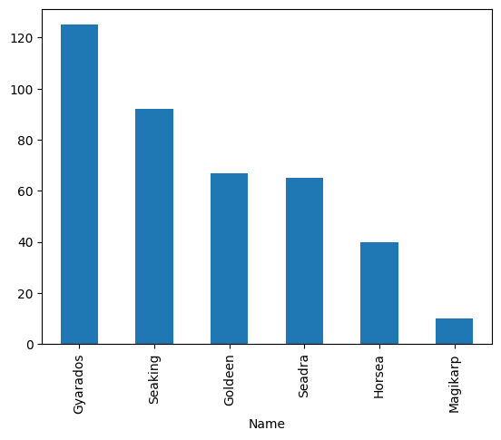

# Indexes & Sorting Exercise

## Part 1
* Import the `pokemon.csv` dataset
* Make the Name column the index (do it in place on the original DataFrame!)


```python
import pandas as pd
```


```python
# open data files
# Import the `pokemon.csv` dataset
pok = pd.read_csv("./../data/Pokemon.csv")
```


```python
# Make the Name column the index (do it in place on the original DataFrame!)
pok.set_index("Name", inplace=True)
pok
```


<div>
<style scoped>
    .dataframe tbody tr th:only-of-type {
        vertical-align: middle;
    }

    .dataframe tbody tr th {
        vertical-align: top;
    }

    .dataframe thead th {
        text-align: right;
    }
</style>
<table border="1" class="dataframe">
  <thead>
    <tr style="text-align: right;">
      <th></th>
      <th>Num</th>
      <th>Type 1</th>
      <th>Type 2</th>
      <th>Total</th>
      <th>HP</th>
      <th>Attack</th>
      <th>Defense</th>
      <th>Sp. Atk</th>
      <th>Sp. Def</th>
      <th>Speed</th>
      <th>Stage</th>
      <th>Legendary</th>
    </tr>
    <tr>
      <th>Name</th>
      <th></th>
      <th></th>
      <th></th>
      <th></th>
      <th></th>
      <th></th>
      <th></th>
      <th></th>
      <th></th>
      <th></th>
      <th></th>
      <th></th>
    </tr>
  </thead>
  <tbody>
    <tr>
      <th>Bulbasaur</th>
      <td>1</td>
      <td>Grass</td>
      <td>Poison</td>
      <td>318</td>
      <td>45</td>
      <td>49</td>
      <td>49</td>
      <td>65</td>
      <td>65</td>
      <td>45</td>
      <td>1</td>
      <td>False</td>
    </tr>
    <tr>
      <th>Ivysaur</th>
      <td>2</td>
      <td>Grass</td>
      <td>Poison</td>
      <td>405</td>
      <td>60</td>
      <td>62</td>
      <td>63</td>
      <td>80</td>
      <td>80</td>
      <td>60</td>
      <td>2</td>
      <td>False</td>
    </tr>
    <tr>
      <th>Venusaur</th>
      <td>3</td>
      <td>Grass</td>
      <td>Poison</td>
      <td>525</td>
      <td>80</td>
      <td>82</td>
      <td>83</td>
      <td>100</td>
      <td>100</td>
      <td>80</td>
      <td>3</td>
      <td>False</td>
    </tr>
    <tr>
      <th>Charmander</th>
      <td>4</td>
      <td>Fire</td>
      <td>NaN</td>
      <td>309</td>
      <td>39</td>
      <td>52</td>
      <td>43</td>
      <td>60</td>
      <td>50</td>
      <td>65</td>
      <td>1</td>
      <td>False</td>
    </tr>
    <tr>
      <th>Charmeleon</th>
      <td>5</td>
      <td>Fire</td>
      <td>NaN</td>
      <td>405</td>
      <td>58</td>
      <td>64</td>
      <td>58</td>
      <td>80</td>
      <td>65</td>
      <td>80</td>
      <td>2</td>
      <td>False</td>
    </tr>
    <tr>
      <th>...</th>
      <td>...</td>
      <td>...</td>
      <td>...</td>
      <td>...</td>
      <td>...</td>
      <td>...</td>
      <td>...</td>
      <td>...</td>
      <td>...</td>
      <td>...</td>
      <td>...</td>
      <td>...</td>
    </tr>
    <tr>
      <th>Dratini</th>
      <td>147</td>
      <td>Dragon</td>
      <td>NaN</td>
      <td>300</td>
      <td>41</td>
      <td>64</td>
      <td>45</td>
      <td>50</td>
      <td>50</td>
      <td>50</td>
      <td>1</td>
      <td>False</td>
    </tr>
    <tr>
      <th>Dragonair</th>
      <td>148</td>
      <td>Dragon</td>
      <td>NaN</td>
      <td>420</td>
      <td>61</td>
      <td>84</td>
      <td>65</td>
      <td>70</td>
      <td>70</td>
      <td>70</td>
      <td>2</td>
      <td>False</td>
    </tr>
    <tr>
      <th>Dragonite</th>
      <td>149</td>
      <td>Dragon</td>
      <td>Flying</td>
      <td>600</td>
      <td>91</td>
      <td>134</td>
      <td>95</td>
      <td>100</td>
      <td>100</td>
      <td>80</td>
      <td>3</td>
      <td>False</td>
    </tr>
    <tr>
      <th>Mewtwo</th>
      <td>150</td>
      <td>Psychic</td>
      <td>NaN</td>
      <td>680</td>
      <td>106</td>
      <td>110</td>
      <td>90</td>
      <td>154</td>
      <td>90</td>
      <td>130</td>
      <td>1</td>
      <td>True</td>
    </tr>
    <tr>
      <th>Mew</th>
      <td>151</td>
      <td>Psychic</td>
      <td>NaN</td>
      <td>600</td>
      <td>100</td>
      <td>100</td>
      <td>100</td>
      <td>100</td>
      <td>100</td>
      <td>100</td>
      <td>1</td>
      <td>False</td>
    </tr>
  </tbody>
</table>
<p>151 rows × 12 columns</p>
</div>


## Part 2
* Sort the pokemon by the Attack column, from highest to lowest
* Sort the pokemon by the Num column, from lowest to highest, in place.
* Sort the pokemon by the Total column AND the Attack column (in that order!) from highest to lowest
* Sort the pokemon by their index, from lowest to highest, in place (From A-Z)


```python
# Sort the pokemon by the Attack column, from highest to lowest
pok.sort_values("Attack", ascending=False)
```


<div>
<style scoped>
    .dataframe tbody tr th:only-of-type {
        vertical-align: middle;
    }

    .dataframe tbody tr th {
        vertical-align: top;
    }

    .dataframe thead th {
        text-align: right;
    }
</style>
<table border="1" class="dataframe">
  <thead>
    <tr style="text-align: right;">
      <th></th>
      <th>Num</th>
      <th>Type 1</th>
      <th>Type 2</th>
      <th>Total</th>
      <th>HP</th>
      <th>Attack</th>
      <th>Defense</th>
      <th>Sp. Atk</th>
      <th>Sp. Def</th>
      <th>Speed</th>
      <th>Stage</th>
      <th>Legendary</th>
    </tr>
    <tr>
      <th>Name</th>
      <th></th>
      <th></th>
      <th></th>
      <th></th>
      <th></th>
      <th></th>
      <th></th>
      <th></th>
      <th></th>
      <th></th>
      <th></th>
      <th></th>
    </tr>
  </thead>
  <tbody>
    <tr>
      <th>Dragonite</th>
      <td>149</td>
      <td>Dragon</td>
      <td>Flying</td>
      <td>600</td>
      <td>91</td>
      <td>134</td>
      <td>95</td>
      <td>100</td>
      <td>100</td>
      <td>80</td>
      <td>3</td>
      <td>False</td>
    </tr>
    <tr>
      <th>Rhydon</th>
      <td>112</td>
      <td>Ground</td>
      <td>Rock</td>
      <td>485</td>
      <td>105</td>
      <td>130</td>
      <td>120</td>
      <td>45</td>
      <td>45</td>
      <td>40</td>
      <td>2</td>
      <td>False</td>
    </tr>
    <tr>
      <th>Flareon</th>
      <td>136</td>
      <td>Fire</td>
      <td>NaN</td>
      <td>525</td>
      <td>65</td>
      <td>130</td>
      <td>60</td>
      <td>95</td>
      <td>110</td>
      <td>65</td>
      <td>2</td>
      <td>False</td>
    </tr>
    <tr>
      <th>Machamp</th>
      <td>68</td>
      <td>Fighting</td>
      <td>NaN</td>
      <td>505</td>
      <td>90</td>
      <td>130</td>
      <td>80</td>
      <td>65</td>
      <td>85</td>
      <td>55</td>
      <td>3</td>
      <td>False</td>
    </tr>
    <tr>
      <th>Kingler</th>
      <td>99</td>
      <td>Water</td>
      <td>NaN</td>
      <td>475</td>
      <td>55</td>
      <td>130</td>
      <td>115</td>
      <td>50</td>
      <td>50</td>
      <td>75</td>
      <td>2</td>
      <td>False</td>
    </tr>
    <tr>
      <th>...</th>
      <td>...</td>
      <td>...</td>
      <td>...</td>
      <td>...</td>
      <td>...</td>
      <td>...</td>
      <td>...</td>
      <td>...</td>
      <td>...</td>
      <td>...</td>
      <td>...</td>
      <td>...</td>
    </tr>
    <tr>
      <th>Kakuna</th>
      <td>14</td>
      <td>Bug</td>
      <td>Poison</td>
      <td>205</td>
      <td>45</td>
      <td>25</td>
      <td>50</td>
      <td>25</td>
      <td>25</td>
      <td>35</td>
      <td>2</td>
      <td>False</td>
    </tr>
    <tr>
      <th>Abra</th>
      <td>63</td>
      <td>Psychic</td>
      <td>NaN</td>
      <td>310</td>
      <td>25</td>
      <td>20</td>
      <td>15</td>
      <td>105</td>
      <td>55</td>
      <td>90</td>
      <td>1</td>
      <td>False</td>
    </tr>
    <tr>
      <th>Metapod</th>
      <td>11</td>
      <td>Bug</td>
      <td>NaN</td>
      <td>205</td>
      <td>50</td>
      <td>20</td>
      <td>55</td>
      <td>25</td>
      <td>25</td>
      <td>30</td>
      <td>2</td>
      <td>False</td>
    </tr>
    <tr>
      <th>Magikarp</th>
      <td>129</td>
      <td>Water</td>
      <td>NaN</td>
      <td>200</td>
      <td>20</td>
      <td>10</td>
      <td>55</td>
      <td>15</td>
      <td>20</td>
      <td>80</td>
      <td>1</td>
      <td>False</td>
    </tr>
    <tr>
      <th>Chansey</th>
      <td>113</td>
      <td>Normal</td>
      <td>NaN</td>
      <td>450</td>
      <td>250</td>
      <td>5</td>
      <td>5</td>
      <td>35</td>
      <td>105</td>
      <td>50</td>
      <td>1</td>
      <td>False</td>
    </tr>
  </tbody>
</table>
<p>151 rows × 12 columns</p>
</div>


```python
# Sort the pokemon by the Num column, from lowest to highest, in place.
pok.sort_values("Num",ascending=True, inplace=True)
pok
```


<div>
<style scoped>
    .dataframe tbody tr th:only-of-type {
        vertical-align: middle;
    }

    .dataframe tbody tr th {
        vertical-align: top;
    }

    .dataframe thead th {
        text-align: right;
    }
</style>
<table border="1" class="dataframe">
  <thead>
    <tr style="text-align: right;">
      <th></th>
      <th>Num</th>
      <th>Type 1</th>
      <th>Type 2</th>
      <th>Total</th>
      <th>HP</th>
      <th>Attack</th>
      <th>Defense</th>
      <th>Sp. Atk</th>
      <th>Sp. Def</th>
      <th>Speed</th>
      <th>Stage</th>
      <th>Legendary</th>
    </tr>
    <tr>
      <th>Name</th>
      <th></th>
      <th></th>
      <th></th>
      <th></th>
      <th></th>
      <th></th>
      <th></th>
      <th></th>
      <th></th>
      <th></th>
      <th></th>
      <th></th>
    </tr>
  </thead>
  <tbody>
    <tr>
      <th>Bulbasaur</th>
      <td>1</td>
      <td>Grass</td>
      <td>Poison</td>
      <td>318</td>
      <td>45</td>
      <td>49</td>
      <td>49</td>
      <td>65</td>
      <td>65</td>
      <td>45</td>
      <td>1</td>
      <td>False</td>
    </tr>
    <tr>
      <th>Ivysaur</th>
      <td>2</td>
      <td>Grass</td>
      <td>Poison</td>
      <td>405</td>
      <td>60</td>
      <td>62</td>
      <td>63</td>
      <td>80</td>
      <td>80</td>
      <td>60</td>
      <td>2</td>
      <td>False</td>
    </tr>
    <tr>
      <th>Venusaur</th>
      <td>3</td>
      <td>Grass</td>
      <td>Poison</td>
      <td>525</td>
      <td>80</td>
      <td>82</td>
      <td>83</td>
      <td>100</td>
      <td>100</td>
      <td>80</td>
      <td>3</td>
      <td>False</td>
    </tr>
    <tr>
      <th>Charmander</th>
      <td>4</td>
      <td>Fire</td>
      <td>NaN</td>
      <td>309</td>
      <td>39</td>
      <td>52</td>
      <td>43</td>
      <td>60</td>
      <td>50</td>
      <td>65</td>
      <td>1</td>
      <td>False</td>
    </tr>
    <tr>
      <th>Charmeleon</th>
      <td>5</td>
      <td>Fire</td>
      <td>NaN</td>
      <td>405</td>
      <td>58</td>
      <td>64</td>
      <td>58</td>
      <td>80</td>
      <td>65</td>
      <td>80</td>
      <td>2</td>
      <td>False</td>
    </tr>
    <tr>
      <th>...</th>
      <td>...</td>
      <td>...</td>
      <td>...</td>
      <td>...</td>
      <td>...</td>
      <td>...</td>
      <td>...</td>
      <td>...</td>
      <td>...</td>
      <td>...</td>
      <td>...</td>
      <td>...</td>
    </tr>
    <tr>
      <th>Dratini</th>
      <td>147</td>
      <td>Dragon</td>
      <td>NaN</td>
      <td>300</td>
      <td>41</td>
      <td>64</td>
      <td>45</td>
      <td>50</td>
      <td>50</td>
      <td>50</td>
      <td>1</td>
      <td>False</td>
    </tr>
    <tr>
      <th>Dragonair</th>
      <td>148</td>
      <td>Dragon</td>
      <td>NaN</td>
      <td>420</td>
      <td>61</td>
      <td>84</td>
      <td>65</td>
      <td>70</td>
      <td>70</td>
      <td>70</td>
      <td>2</td>
      <td>False</td>
    </tr>
    <tr>
      <th>Dragonite</th>
      <td>149</td>
      <td>Dragon</td>
      <td>Flying</td>
      <td>600</td>
      <td>91</td>
      <td>134</td>
      <td>95</td>
      <td>100</td>
      <td>100</td>
      <td>80</td>
      <td>3</td>
      <td>False</td>
    </tr>
    <tr>
      <th>Mewtwo</th>
      <td>150</td>
      <td>Psychic</td>
      <td>NaN</td>
      <td>680</td>
      <td>106</td>
      <td>110</td>
      <td>90</td>
      <td>154</td>
      <td>90</td>
      <td>130</td>
      <td>1</td>
      <td>True</td>
    </tr>
    <tr>
      <th>Mew</th>
      <td>151</td>
      <td>Psychic</td>
      <td>NaN</td>
      <td>600</td>
      <td>100</td>
      <td>100</td>
      <td>100</td>
      <td>100</td>
      <td>100</td>
      <td>100</td>
      <td>1</td>
      <td>False</td>
    </tr>
  </tbody>
</table>
<p>151 rows × 12 columns</p>
</div>


```python
# Sort the pokemon by the Total column AND the Attack column (in that order!) from highest to lowest
pok.sort_values(by=["Total","Attack"], ascending=False, inplace=True)
pok
```


<div>
<style scoped>
    .dataframe tbody tr th:only-of-type {
        vertical-align: middle;
    }

    .dataframe tbody tr th {
        vertical-align: top;
    }

    .dataframe thead th {
        text-align: right;
    }
</style>
<table border="1" class="dataframe">
  <thead>
    <tr style="text-align: right;">
      <th></th>
      <th>Num</th>
      <th>Type 1</th>
      <th>Type 2</th>
      <th>Total</th>
      <th>HP</th>
      <th>Attack</th>
      <th>Defense</th>
      <th>Sp. Atk</th>
      <th>Sp. Def</th>
      <th>Speed</th>
      <th>Stage</th>
      <th>Legendary</th>
    </tr>
    <tr>
      <th>Name</th>
      <th></th>
      <th></th>
      <th></th>
      <th></th>
      <th></th>
      <th></th>
      <th></th>
      <th></th>
      <th></th>
      <th></th>
      <th></th>
      <th></th>
    </tr>
  </thead>
  <tbody>
    <tr>
      <th>Mewtwo</th>
      <td>150</td>
      <td>Psychic</td>
      <td>NaN</td>
      <td>680</td>
      <td>106</td>
      <td>110</td>
      <td>90</td>
      <td>154</td>
      <td>90</td>
      <td>130</td>
      <td>1</td>
      <td>True</td>
    </tr>
    <tr>
      <th>Dragonite</th>
      <td>149</td>
      <td>Dragon</td>
      <td>Flying</td>
      <td>600</td>
      <td>91</td>
      <td>134</td>
      <td>95</td>
      <td>100</td>
      <td>100</td>
      <td>80</td>
      <td>3</td>
      <td>False</td>
    </tr>
    <tr>
      <th>Mew</th>
      <td>151</td>
      <td>Psychic</td>
      <td>NaN</td>
      <td>600</td>
      <td>100</td>
      <td>100</td>
      <td>100</td>
      <td>100</td>
      <td>100</td>
      <td>100</td>
      <td>1</td>
      <td>False</td>
    </tr>
    <tr>
      <th>Moltres</th>
      <td>146</td>
      <td>Fire</td>
      <td>Flying</td>
      <td>580</td>
      <td>90</td>
      <td>100</td>
      <td>90</td>
      <td>125</td>
      <td>85</td>
      <td>90</td>
      <td>1</td>
      <td>True</td>
    </tr>
    <tr>
      <th>Zapdos</th>
      <td>145</td>
      <td>Electric</td>
      <td>Flying</td>
      <td>580</td>
      <td>90</td>
      <td>90</td>
      <td>85</td>
      <td>125</td>
      <td>90</td>
      <td>100</td>
      <td>1</td>
      <td>True</td>
    </tr>
    <tr>
      <th>...</th>
      <td>...</td>
      <td>...</td>
      <td>...</td>
      <td>...</td>
      <td>...</td>
      <td>...</td>
      <td>...</td>
      <td>...</td>
      <td>...</td>
      <td>...</td>
      <td>...</td>
      <td>...</td>
    </tr>
    <tr>
      <th>Kakuna</th>
      <td>14</td>
      <td>Bug</td>
      <td>Poison</td>
      <td>205</td>
      <td>45</td>
      <td>25</td>
      <td>50</td>
      <td>25</td>
      <td>25</td>
      <td>35</td>
      <td>2</td>
      <td>False</td>
    </tr>
    <tr>
      <th>Metapod</th>
      <td>11</td>
      <td>Bug</td>
      <td>NaN</td>
      <td>205</td>
      <td>50</td>
      <td>20</td>
      <td>55</td>
      <td>25</td>
      <td>25</td>
      <td>30</td>
      <td>2</td>
      <td>False</td>
    </tr>
    <tr>
      <th>Magikarp</th>
      <td>129</td>
      <td>Water</td>
      <td>NaN</td>
      <td>200</td>
      <td>20</td>
      <td>10</td>
      <td>55</td>
      <td>15</td>
      <td>20</td>
      <td>80</td>
      <td>1</td>
      <td>False</td>
    </tr>
    <tr>
      <th>Weedle</th>
      <td>13</td>
      <td>Bug</td>
      <td>Poison</td>
      <td>195</td>
      <td>40</td>
      <td>35</td>
      <td>30</td>
      <td>20</td>
      <td>20</td>
      <td>50</td>
      <td>1</td>
      <td>False</td>
    </tr>
    <tr>
      <th>Caterpie</th>
      <td>10</td>
      <td>Bug</td>
      <td>NaN</td>
      <td>195</td>
      <td>45</td>
      <td>30</td>
      <td>35</td>
      <td>20</td>
      <td>20</td>
      <td>45</td>
      <td>1</td>
      <td>False</td>
    </tr>
  </tbody>
</table>
<p>151 rows × 12 columns</p>
</div>


```python
# Sort the pokemon by their index, from lowest to highest, in place (From A-Z)
pok.sort_index(ascending=True, inplace=True)
pok
```


<div>
<style scoped>
    .dataframe tbody tr th:only-of-type {
        vertical-align: middle;
    }

    .dataframe tbody tr th {
        vertical-align: top;
    }

    .dataframe thead th {
        text-align: right;
    }
</style>
<table border="1" class="dataframe">
  <thead>
    <tr style="text-align: right;">
      <th></th>
      <th>Num</th>
      <th>Type 1</th>
      <th>Type 2</th>
      <th>Total</th>
      <th>HP</th>
      <th>Attack</th>
      <th>Defense</th>
      <th>Sp. Atk</th>
      <th>Sp. Def</th>
      <th>Speed</th>
      <th>Stage</th>
      <th>Legendary</th>
    </tr>
    <tr>
      <th>Name</th>
      <th></th>
      <th></th>
      <th></th>
      <th></th>
      <th></th>
      <th></th>
      <th></th>
      <th></th>
      <th></th>
      <th></th>
      <th></th>
      <th></th>
    </tr>
  </thead>
  <tbody>
    <tr>
      <th>Abra</th>
      <td>63</td>
      <td>Psychic</td>
      <td>NaN</td>
      <td>310</td>
      <td>25</td>
      <td>20</td>
      <td>15</td>
      <td>105</td>
      <td>55</td>
      <td>90</td>
      <td>1</td>
      <td>False</td>
    </tr>
    <tr>
      <th>Aerodactyl</th>
      <td>142</td>
      <td>Rock</td>
      <td>Flying</td>
      <td>515</td>
      <td>80</td>
      <td>105</td>
      <td>65</td>
      <td>60</td>
      <td>75</td>
      <td>130</td>
      <td>1</td>
      <td>False</td>
    </tr>
    <tr>
      <th>Alakazam</th>
      <td>65</td>
      <td>Psychic</td>
      <td>NaN</td>
      <td>500</td>
      <td>55</td>
      <td>50</td>
      <td>45</td>
      <td>135</td>
      <td>95</td>
      <td>120</td>
      <td>3</td>
      <td>False</td>
    </tr>
    <tr>
      <th>Arbok</th>
      <td>24</td>
      <td>Poison</td>
      <td>NaN</td>
      <td>438</td>
      <td>60</td>
      <td>85</td>
      <td>69</td>
      <td>65</td>
      <td>79</td>
      <td>80</td>
      <td>2</td>
      <td>False</td>
    </tr>
    <tr>
      <th>Arcanine</th>
      <td>59</td>
      <td>Fire</td>
      <td>NaN</td>
      <td>555</td>
      <td>90</td>
      <td>110</td>
      <td>80</td>
      <td>100</td>
      <td>80</td>
      <td>95</td>
      <td>2</td>
      <td>False</td>
    </tr>
    <tr>
      <th>...</th>
      <td>...</td>
      <td>...</td>
      <td>...</td>
      <td>...</td>
      <td>...</td>
      <td>...</td>
      <td>...</td>
      <td>...</td>
      <td>...</td>
      <td>...</td>
      <td>...</td>
      <td>...</td>
    </tr>
    <tr>
      <th>Weepinbell</th>
      <td>70</td>
      <td>Grass</td>
      <td>Poison</td>
      <td>390</td>
      <td>65</td>
      <td>90</td>
      <td>50</td>
      <td>85</td>
      <td>45</td>
      <td>55</td>
      <td>2</td>
      <td>False</td>
    </tr>
    <tr>
      <th>Weezing</th>
      <td>110</td>
      <td>Poison</td>
      <td>NaN</td>
      <td>490</td>
      <td>65</td>
      <td>90</td>
      <td>120</td>
      <td>85</td>
      <td>70</td>
      <td>60</td>
      <td>2</td>
      <td>False</td>
    </tr>
    <tr>
      <th>Wigglytuff</th>
      <td>40</td>
      <td>Normal</td>
      <td>Fairy</td>
      <td>435</td>
      <td>140</td>
      <td>70</td>
      <td>45</td>
      <td>85</td>
      <td>50</td>
      <td>45</td>
      <td>2</td>
      <td>False</td>
    </tr>
    <tr>
      <th>Zapdos</th>
      <td>145</td>
      <td>Electric</td>
      <td>Flying</td>
      <td>580</td>
      <td>90</td>
      <td>90</td>
      <td>85</td>
      <td>125</td>
      <td>90</td>
      <td>100</td>
      <td>1</td>
      <td>True</td>
    </tr>
    <tr>
      <th>Zubat</th>
      <td>41</td>
      <td>Poison</td>
      <td>Flying</td>
      <td>245</td>
      <td>40</td>
      <td>45</td>
      <td>35</td>
      <td>30</td>
      <td>40</td>
      <td>55</td>
      <td>1</td>
      <td>False</td>
    </tr>
  </tbody>
</table>
<p>151 rows × 12 columns</p>
</div>


## Part 3

* Find the average Speed of the 10 pokemon with the highest Speed.
* Of the top 20 pokemon with the highest Attack values, what is the most common value for "Type 1"? 


```python
# Find the average Speed of the 10 pokemon with the highest Speed.
top_ten = pok["Speed"].nlargest(10).mean()
top_ten
```


    122.0


```python

# Of the top 20 pokemon with the highest Attack values, what is the most common value for "Type 1"? 
top_20_attack = pok.sort_values(by="Attack", ascending=False).head(20)
top_20_attack["Type 1"].mode()
```


    0    Fighting
    Name: Type 1, dtype: object


## Part 4
* Retrieve the row with the index label of "Diglett"
* Retrieve the rows for the two fox-like Pokemon: Eevee and Vulpix
* Make sure your DataFrame is sorted by index (A-Z).  Retrieve the rows from Charizard to Charmeleon.  You should get three rows back.
* Retrieve the 30th, 40th, and 50th rows by position.


```python
# Retrieve the row with the index label of "Diglett"
pok.loc["Diglett"]
```


    Num              50
    Type 1       Ground
    Type 2          NaN
    Total           265
    HP               10
    Attack           55
    Defense          25
    Sp. Atk          35
    Sp. Def          45
    Speed            95
    Stage             1
    Legendary     False
    Name: Diglett, dtype: object


```python
# Retrieve the rows for the two fox-like Pokemon: Eevee and Vulpix
pok.loc[["Eevee", "Vulpix"]]
```


<div>
<style scoped>
    .dataframe tbody tr th:only-of-type {
        vertical-align: middle;
    }

    .dataframe tbody tr th {
        vertical-align: top;
    }

    .dataframe thead th {
        text-align: right;
    }
</style>
<table border="1" class="dataframe">
  <thead>
    <tr style="text-align: right;">
      <th></th>
      <th>Num</th>
      <th>Type 1</th>
      <th>Type 2</th>
      <th>Total</th>
      <th>HP</th>
      <th>Attack</th>
      <th>Defense</th>
      <th>Sp. Atk</th>
      <th>Sp. Def</th>
      <th>Speed</th>
      <th>Stage</th>
      <th>Legendary</th>
    </tr>
    <tr>
      <th>Name</th>
      <th></th>
      <th></th>
      <th></th>
      <th></th>
      <th></th>
      <th></th>
      <th></th>
      <th></th>
      <th></th>
      <th></th>
      <th></th>
      <th></th>
    </tr>
  </thead>
  <tbody>
    <tr>
      <th>Eevee</th>
      <td>133</td>
      <td>Normal</td>
      <td>NaN</td>
      <td>325</td>
      <td>55</td>
      <td>55</td>
      <td>50</td>
      <td>45</td>
      <td>65</td>
      <td>55</td>
      <td>1</td>
      <td>False</td>
    </tr>
    <tr>
      <th>Vulpix</th>
      <td>37</td>
      <td>Fire</td>
      <td>NaN</td>
      <td>299</td>
      <td>38</td>
      <td>41</td>
      <td>40</td>
      <td>50</td>
      <td>65</td>
      <td>65</td>
      <td>1</td>
      <td>False</td>
    </tr>
  </tbody>
</table>
</div>


```python
'''
 *
 * C. Make sure your DataFrame is sorted by index (A-Z).  Retrieve the
 *    rows from Charizard to Charmeleon.  You should get three rows back.
 *
'''
sorted_pok = pok.sort_index()
sorted_pok.loc["Charizard":"Charmeleon"]


```


<div>
<style scoped>
    .dataframe tbody tr th:only-of-type {
        vertical-align: middle;
    }

    .dataframe tbody tr th {
        vertical-align: top;
    }

    .dataframe thead th {
        text-align: right;
    }
</style>
<table border="1" class="dataframe">
  <thead>
    <tr style="text-align: right;">
      <th></th>
      <th>Num</th>
      <th>Type 1</th>
      <th>Type 2</th>
      <th>Total</th>
      <th>HP</th>
      <th>Attack</th>
      <th>Defense</th>
      <th>Sp. Atk</th>
      <th>Sp. Def</th>
      <th>Speed</th>
      <th>Stage</th>
      <th>Legendary</th>
    </tr>
    <tr>
      <th>Name</th>
      <th></th>
      <th></th>
      <th></th>
      <th></th>
      <th></th>
      <th></th>
      <th></th>
      <th></th>
      <th></th>
      <th></th>
      <th></th>
      <th></th>
    </tr>
  </thead>
  <tbody>
    <tr>
      <th>Charizard</th>
      <td>6</td>
      <td>Fire</td>
      <td>Flying</td>
      <td>534</td>
      <td>78</td>
      <td>84</td>
      <td>78</td>
      <td>109</td>
      <td>85</td>
      <td>100</td>
      <td>3</td>
      <td>False</td>
    </tr>
    <tr>
      <th>Charmander</th>
      <td>4</td>
      <td>Fire</td>
      <td>NaN</td>
      <td>309</td>
      <td>39</td>
      <td>52</td>
      <td>43</td>
      <td>60</td>
      <td>50</td>
      <td>65</td>
      <td>1</td>
      <td>False</td>
    </tr>
    <tr>
      <th>Charmeleon</th>
      <td>5</td>
      <td>Fire</td>
      <td>NaN</td>
      <td>405</td>
      <td>58</td>
      <td>64</td>
      <td>58</td>
      <td>80</td>
      <td>65</td>
      <td>80</td>
      <td>2</td>
      <td>False</td>
    </tr>
  </tbody>
</table>
</div>


## Part 5
* Retrieve the rows of the fish-like Pokemon.  Use this list to make it easier:
```py
fish_pokemon = ["Magikarp", "Goldeen","Horsea", "Seaking", "Seadra","Gyarados"]
```


```python
fish_pokemon = ["Magikarp", "Goldeen","Horsea", "Seaking", "Seadra","Gyarados"]
pok.loc[fish_pokemon]
```


<div>
<style scoped>
    .dataframe tbody tr th:only-of-type {
        vertical-align: middle;
    }

    .dataframe tbody tr th {
        vertical-align: top;
    }

    .dataframe thead th {
        text-align: right;
    }
</style>
<table border="1" class="dataframe">
  <thead>
    <tr style="text-align: right;">
      <th></th>
      <th>Num</th>
      <th>Type 1</th>
      <th>Type 2</th>
      <th>Total</th>
      <th>HP</th>
      <th>Attack</th>
      <th>Defense</th>
      <th>Sp. Atk</th>
      <th>Sp. Def</th>
      <th>Speed</th>
      <th>Stage</th>
      <th>Legendary</th>
    </tr>
    <tr>
      <th>Name</th>
      <th></th>
      <th></th>
      <th></th>
      <th></th>
      <th></th>
      <th></th>
      <th></th>
      <th></th>
      <th></th>
      <th></th>
      <th></th>
      <th></th>
    </tr>
  </thead>
  <tbody>
    <tr>
      <th>Magikarp</th>
      <td>129</td>
      <td>Water</td>
      <td>NaN</td>
      <td>200</td>
      <td>20</td>
      <td>10</td>
      <td>55</td>
      <td>15</td>
      <td>20</td>
      <td>80</td>
      <td>1</td>
      <td>False</td>
    </tr>
    <tr>
      <th>Goldeen</th>
      <td>118</td>
      <td>Water</td>
      <td>NaN</td>
      <td>320</td>
      <td>45</td>
      <td>67</td>
      <td>60</td>
      <td>35</td>
      <td>50</td>
      <td>63</td>
      <td>1</td>
      <td>False</td>
    </tr>
    <tr>
      <th>Horsea</th>
      <td>116</td>
      <td>Water</td>
      <td>NaN</td>
      <td>295</td>
      <td>30</td>
      <td>40</td>
      <td>70</td>
      <td>70</td>
      <td>25</td>
      <td>60</td>
      <td>1</td>
      <td>False</td>
    </tr>
    <tr>
      <th>Seaking</th>
      <td>119</td>
      <td>Water</td>
      <td>NaN</td>
      <td>450</td>
      <td>80</td>
      <td>92</td>
      <td>65</td>
      <td>65</td>
      <td>80</td>
      <td>68</td>
      <td>2</td>
      <td>False</td>
    </tr>
    <tr>
      <th>Seadra</th>
      <td>117</td>
      <td>Water</td>
      <td>NaN</td>
      <td>440</td>
      <td>55</td>
      <td>65</td>
      <td>95</td>
      <td>95</td>
      <td>45</td>
      <td>85</td>
      <td>2</td>
      <td>False</td>
    </tr>
    <tr>
      <th>Gyarados</th>
      <td>130</td>
      <td>Water</td>
      <td>Flying</td>
      <td>540</td>
      <td>95</td>
      <td>125</td>
      <td>79</td>
      <td>60</td>
      <td>100</td>
      <td>81</td>
      <td>2</td>
      <td>False</td>
    </tr>
  </tbody>
</table>
</div>


## Part 6

* Create this bar chart that shows the Attack values for the above fish-like Pokemon.  Pay attention to the sorting!!
<div>

</div>


```python
pok.loc[fish_pokemon]["Attack"].sort_values(ascending=False).plot(kind="bar")
```


    <AxesSubplot: xlabel='Name'>


    

    

